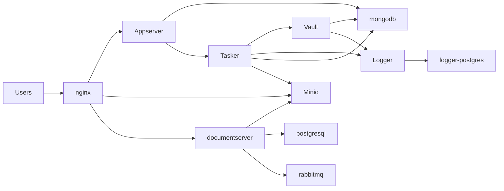

<!-- TOC --><a name="-unicchat"></a>
# Инструкция по установке корпоративного мессенджера для общения и командной работы UnicChat

версия документа 1.12

<!-- TOC --><a name=""></a>
## Оглавление

<!-- TOC start (generated with https://github.com/derlin/bitdowntoc) -->

- [Описание продукта](#-)
- [Скачать инструкции в PDF ](#-pdf)
- [Архитектура установки](#--1)
   * [Установка на 1-м сервере](#-1-)
   * [Установка на 2-х серверах (рекомендуется для промышленного использования)](#-2-)
   * [Один docker-compose.yml](#-one-compose)
   * [Установка на отдельных серверах](#-multi-host)
- [Обязательные компоненты](#--2)
      + [Push шлюз](#push-)
      + [ВКС шлюз](#--3)
      + [Приложения UnicChat](#-unicchat-1)
- [Опциональные компоненты](#--4)
      + [SMTP сервер](#smtp-)
      + [LDAP сервер](#ldap-)
- [Шаг 1. Подготовка окружения](#-1--1)
   * [1.1 Требования к конфигурации](#11-)
      + [Требования к конфигурации на 20 пользователей. Приложение и БД устанавливаются на 1-й виртуальной машине](#-20-1-)
      + [Конфигурация виртуальной машины](#--5)
      + [Требования к конфигурации на 20-50 пользователей. Приложение и БД устанавливаются на разные виртуальные машины](#-20-50-)
      + [Конфигурация виртуальной машины для приложения](#--6)
      + [Конфигурация виртуальной машины для БД](#--7)
   * [1.2. Запрос лицензии для Unicchat Solid Core](#12-unicchat-solid-core)
   * [1.3. Клонирование репозитория](#13-)
   * [1.4 Зарегистрировать DNS имена](#14-dns-)
- [Шаг 2. Установка](#-2-install)
   * [Права и доступы, которые нужно выдать](#-2-perms)
   * [2.1 Установите Docker](#21-docker)
   * [2.2 Проверка поддержки AVX процессором](#22-avx-)
   * [2.3 Авторизация в Container Registry](#26-container-registry)
   * [2.4 Файл `.env`](#24-env)
      + [Свои секреты и учётные данные](#24-secrets)
   * [2.5 SSL-сертификаты (Certbot)](#25-certbot)
   * [2.6 Nginx](#26-nginx)
   * [2.7 Запуск](#27-unicchat)
   * [2.8 Проверка](#28-check)
   * [2.9 Открытие сетевых доступов и портов](#215-)
      + [Входящие соединения на сервере UnicChat](#-unicchat-2)
      + [Исходящие соединения](#--15)
- [Шаг 2a. Установка на отдельных серверах](#-2a-multi)
   * [Что такое роль](#-2a-role)
   * [Состав серверов](#-2a-map)
   * [Файлы ролей](#-2a-roles)
   * [Общий `.env` и адреса](#-2a-env)
   * [Порядок запуска](#-2a-order)
   * [Секрет Vault KBTConfigs](#-2a-vault)
   * [Nginx и сертификаты](#-2a-nginx)
   * [Частые ошибки](#-2a-troubles)
- [Шаг 3. Установка локального медиа сервера для ВКС](#-3-)
- [Шаг 6. Создание пользователя администратора](#-6-)
- [Шаг 7. Настройка push-уведомлений](#-7-push-)
- [Опциональные компоненты](#--16)
   * [Шаг 8. Настройка redminebot](#-8-redminebot)
      + [8.1 Настройка redminebot](#81-redminebot)
      + [8.2 Подключение UnicChat к redminebot](#82-unicchat-redminebot)
   * [Важные замечания](#--17)
- [Клиентские приложения](#--18)

<!-- TOC end -->


<!-- TOC --><a name="-"></a>
## Описание продукта
* [Описание архитектуры UnicChat.pdf](https://github.com/unicommorg/unicchat.enterprise/blob/main/docs/%D0%9E%D0%BF%D0%B8%D1%81%D0%B0%D0%BD%D0%B8%D0%B5%20%D0%B0%D1%80%D1%85%D0%B8%D1%82%D0%B5%D0%BA%D1%82%D1%83%D1%80%D1%8B%20UnicChat.pdf)
* [Описание архитектуры UnicChat.docx](https://github.com/unicommorg/unicchat.enterprise/blob/main/docs/%D0%9E%D0%BF%D0%B8%D1%81%D0%B0%D0%BD%D0%B8%D0%B5%20%D0%B0%D1%80%D1%85%D0%B8%D1%82%D0%B5%D0%BA%D1%82%D1%83%D1%80%D1%8B%20UnicChat.docx)
* [UnicChat Описание продукта.pdf](https://github.com/unicommorg/unicchat.enterprise/blob/main/docs/UnicChat%20%D0%9E%D0%BF%D0%B8%D1%81%D0%B0%D0%BD%D0%B8%D0%B5%20%D0%BF%D1%80%D0%BE%D0%B4%D1%83%D0%BA%D1%82%D0%B0.pdf)
* [UnicChat Описание продукта.docx](https://github.com/unicommorg/unicchat.enterprise/blob/6b4b0d010ff633b9bdb9899a9a4d088150fd7f80/docs/UnicChat%20%D0%9E%D0%BF%D0%B8%D1%81%D0%B0%D0%BD%D0%B8%D0%B5%20%D0%BF%D1%80%D0%BE%D0%B4%D1%83%D0%BA%D1%82%D0%B0.docx)
<!-- TOC --><a name="-pdf"></a>
## Скачать инструкции в PDF 

Инструкции для unicchat лежат в репозитории [docs](https://github.com/unicommorg/unicchat.enterprise/tree/main/docs)

* [Инструкция пользователя UnicChat.pdf](https://github.com/unicommorg/unicchat.enterprise/blob/main/docs/%D0%98%D0%BD%D1%81%D1%82%D1%80%D1%83%D0%BA%D1%86%D0%B8%D1%8F%20%D0%BF%D0%BE%D0%BB%D1%8C%D0%B7%D0%BE%D0%B2%D0%B0%D1%82%D0%B5%D0%BB%D1%8F%20UnicChat.pdf)
* [Инструкция_по_администрированию_UnicChat.pdf](https://github.com/unicommorg/unicchat.enterprise/blob/main/docs/%D0%98%D0%BD%D1%81%D1%82%D1%80%D1%83%D0%BA%D1%86%D0%B8%D1%8F_%D0%BF%D0%BE_%D0%B0%D0%B4%D0%BC%D0%B8%D0%BD%D0%B8%D1%81%D1%82%D1%80%D0%B8%D1%80%D0%BE%D0%B2%D0%B0%D0%BD%D0%B8%D1%8E_UnicChat.pdf)
* [Инструкция_по_лицензированию_UnicChat.pdf](https://github.com/unicommorg/unicchat.enterprise/blob/main/docs/%D0%98%D0%BD%D1%81%D1%82%D1%80%D1%83%D0%BA%D1%86%D0%B8%D1%8F_%D0%BF%D0%BE_%D0%BB%D0%B8%D1%86%D0%B5%D0%BD%D0%B7%D0%B8%D1%80%D0%BE%D0%B2%D0%B0%D0%BD%D0%B8%D1%8E_UnicChat.pdf)

<!-- TOC --><a name="--1"></a>
## Архитектура установки

___

<!-- TOC --><a name="-1-"></a>
### Установка на 1-м сервере


<!-- TOC --><a name="-2-"></a>
### Установка на 2-х серверах (рекомендуется для промышленного использования)


Схемы 1VM/2VM задают **ёмкость**. Во всех случаях используется один файл `multi-server-install/docker-compose.yml`.

<!-- TOC --><a name="-one-compose"></a>
### Один docker-compose.yml

Базовая установка (шаг 2) — все сервисы на одном сервере. Порядок: `.env` → сертификаты (п. 2.5) → `compose up`. 
```shell
cd multi-server-install
docker compose up -d --wait
```


<!-- TOC --><a name="-multi-host"></a>
### Установка на отдельных серверах

| Сервер | Команда |
|--------|---------|
| MongoDB | `docker compose -f compose.mongodb.yml up -d` |
| Vault | `docker compose -f compose.vault.yml up -d` |
| Logger | `docker compose -f compose.logger.yml up -d` |
| MinIO | `docker compose -f compose.minio.yml up -d` |
| Tasker | `docker compose -f compose.tasker.yml up -d` |
| Knowledgebase | `docker compose -f compose.knowledgebase.yml up -d` |
| AppServer | `docker compose -f compose.appserver.yml up -d` |
| Nginx | `docker compose -f compose.nginx.yml up -d` |


```mermaid
flowchart LR
  Users[Users] --> Nginx[nginx]
  Nginx --> Appserver
  Nginx --> Minio
  Nginx --> Docs[documentserver]
  Appserver --> Mongo[mongodb]
  Appserver --> Tasker
  Tasker --> Vault
  Tasker --> Logger
  Tasker --> Mongo
  Tasker --> Minio
  Docs --> Minio
  Docs --> Pg[postgresql]
  Docs --> Rabbit[rabbitmq]
  Vault --> Mongo
  Vault --> Logger
  Logger --> LoggerPg[logger-postgres]
```

Подробности — [шаг 2a](#-2a-multi).

<!-- TOC --><a name="--2"></a>
## Обязательные компоненты

___

<!-- TOC --><a name="push-"></a>
#### Push шлюз

Публичный сервис компании Unicomm. Подключение к нему необходимо для отправки push-сообщений на мобильные платформы Apple и Google.
Расположен во внешнем периметре на серверах компании. Серверу UnicChat требуются исходящие соединения к этому сервису и не требуются входящие соединения.

<!-- TOC --><a name="--3"></a>
#### ВКС шлюз

Публичный сервис компании Unicomm. Подключение к нему необходимо для работы аудио и видео конференций, а также аудио-звонков.
Расположены во внешнем периметре на серверах компании. Серверу UnicChat требуются исходящие соединения к этому сервису и не требуются входящие соединения.

<!-- TOC --><a name="-unicchat-1"></a>
#### Приложения UnicChat

Пользовательское приложение, установленное на iOS или Android платформе.
Сервер UnicChat должен иметь возможность принимать входящие сообщения от этих приложений, а также отправлять ответы.
Основное взаимодействие осуществляется через протокол HTTPS (443/TCP).
Для работы видео- и аудиозвонков необходимы протоколы STUN и TURN: входящие соединения на порты 7881/TCP и 7882/UDP, а также входящий и исходящий трафик UDP по портам 50000-60000 (RTP-трафик).

<!-- TOC --><a name="--4"></a>
## Опциональные компоненты

___

<!-- TOC --><a name="smtp-"></a>
#### SMTP сервер

Используется для отправки OTP-сообщений, восстановлений пароля, напоминания о пропущенных сообщениях, предоставляется вами.
Может быть использован как публичный, так и ваш собственный сервер. На схеме предполагается, что сервер находится в вашем сегменте DMZ.
**Интеграция с SMTP не является обязательным условием.**

<!-- TOC --><a name="ldap-"></a>
#### LDAP сервер

Используется для получения списка пользователей в системе. UnicChat может обслуживать как пользователей, заведенных в LDAP каталоге, так и внутренних пользователей в собственной базе. **Интеграция с LDAP не является обязательным условием**
#### 

<!-- TOC --><a name="-1--1"></a>
## Шаг 1. Подготовка окружения

<!-- TOC --><a name="11-"></a>
### 1.1 Требования к конфигурации

<!-- TOC --><a name="-20-1-"></a>
#### Требования к конфигурации на 20 пользователей. Приложение и БД устанавливаются на 1-й виртуальной машине

<!-- TOC --><a name="--5"></a>
#### Конфигурация виртуальной машины

```
CPU 4 cores 1.7ghz, с набором инструкций FMA3, SSE4.2, AVX 2.0;
RAM 8 Gb;
150 Gb HDD\SSD;
```

<!-- TOC --><a name="-20-50-"></a>
#### Требования к конфигурации на 20-50 пользователей. Приложение и БД устанавливаются на разные виртуальные машины

<!-- TOC --><a name="--6"></a>
#### Конфигурация виртуальной машины для приложения

```
CPU 4 cores 1.7ghz, с набором инструкций FMA3, SSE4.2;
RAM 8 Gb;
200 Gb HDD\SSD
```

<!-- TOC --><a name="--7"></a>
#### Конфигурация виртуальной машины для БД

```
CPU 4 cores 1.7ghz, с набором инструкций FMA3, SSE4.2, AVX 2.0;
RAM 8 Gb;
100 Gb HDD\SSD
```

<!-- TOC --><a name="12-unicchat-solid-core"></a>
### 1.2. Запрос лицензии для Unicchat Solid Core

> **Обязательный шаг. Запросите лицензию Unicchat Solid Core в компании Unicomm до начала установки.**
>
> **Без действующей лицензии контейнеры поднимутся, но продукт работать не будет.**


<!-- TOC --><a name="13-"></a>
### 1.3. Клонирование репозитория

1. Скачать при помощи `git` командой `git clone` файлы по https://github.com/unicommorg/unicchat.enterprise.git.
 Выполнить на сервере

```shell
git clone https://github.com/unicommorg/unicchat.enterprise.git
```
2. Либо клонируйте репозиторий иным способом.

<!-- TOC --><a name="14-dns-"></a>
### 1.4 Зарегистрировать DNS имена

Перед началом работы запросите DNS-имена. Имена ниже — примеры. Подставьте свои в `multi-server-install/.env`.

| Назначение | Переменная в `.env` | Пример |
|------------|---------------------|--------|
| Веб-интерфейс UnicChat | `APP_SERVER_NAME` | `myapp.unic.chat` |
| MinIO (S3) | `MINIO_SERVER_NAME` | `myminio.unic.chat` |
| DocumentServer | `DOCUMENTSERVER_SERVER_NAME` | `myedt.unic.chat` |

На одной машине все три A-записи указывают на IP сервера с nginx (порты 80/443). При разнесении по серверам A-записи смотрят на сервер роли Nginx (`compose.nginx.yml`), либо на ваш внешний nginx.

1. UnicChat (основной сервис мессенджера)
* **myapp.unic.chat** (`APP_SERVER_NAME`)

   **Назначение**: адрес, через который пользователи открывают веб-интерфейс. HTTPS, WebSocket.

2. Хранение и редактирование документов
* **myminio.unic.chat** (`MINIO_SERVER_NAME`)

   **Назначение**: S3-совместимое хранилище файлов и документов. Бакеты `unicchat-files` и `uc.onlyoffice.docs` создаёт init-контейнер `minio-init`. Консоль MinIO слушает порт 9002 на хосте MinIO (не обязательна с интернета).

* **myedt.unic.chat** (`DOCUMENTSERVER_SERVER_NAME`)

   **Назначение**: DocumentServer для совместного редактирования документов.

На одном сервере MinIO и DocumentServer ходят друг к другу по именам контейнеров. На разных серверах — по IP/DNS из `.env`.

3. Медиасервер ВКС (ставится отдельно, шаг 3)
* **mylk-yc.unic.chat** — ВКС-шлюз
* **turn.mylk-yc.unic.chat** — TURN
* **whip.mylk-yc.unic.chat** — WHIP

<!-- TOC --><a name="-2-install"></a>
## Шаг 2. Установка

Установка на **одном сервере** из каталога `multi-server-install/`: один `docker-compose.yml` и один `.env`. Сеть `unicchat-network`, пользователи MongoDB (vault/tasker), пользователь PostgreSQL Logger, секрет Vault `KBTConfigs` и бакеты MinIO создаются init-контейнерами.

Состав: MongoDB, Vault, Logger (+ PostgreSQL Logger), AppServer, Tasker, nginx, MinIO, DocumentServer (+ PostgreSQL и RabbitMQ), init-контейнеры `vault-mongo-init`, `vault-init`, `minio-init`, `nginx-config-init`, `logger-postgres-init`.

Разнесение по серверам — [шаг 2a](#-2a-multi): на каждом сервере свой `compose.<роль>.yml`.

Перед установкой нужна действующая лицензия UnicChat Solid Core (раздел 1.2). Без неё система не заработает корректно.

<!-- TOC --><a name="-2-perms"></a>
### Права и доступы, которые нужно выдать

Без этого `compose up` или выпуск сертификатов не дойдут до конца. Раздайте заранее.

**На сервере (ОС)**

| Кому | Зачем |
|------|--------|
| Пользователь в группе `sudo` | Установка Docker, `ufw`, правки системных лимитов |
| Тот же пользователь в группе `docker` | `docker compose` и `docker login` без `sudo` (`sudo usermod -aG docker $USER`, затем перелогин) |
| Право слушать порты 80 и 443 | Certbot standalone и контейнер nginx. На время выпуска сертификатов порты должны быть свободны |
| Запись в каталог установки | `multi-server-install/.env`, `nginx/conf.d/`. Certbot пишет в `certs/` от root — каталог должен существовать, после выпуска ключи остаются `root:root` (nginx в контейнере читает их как root, этого достаточно) |

**Сеть и DNS**

| Что | Зачем |
|-----|--------|
| A-записи трёх имён — см. таблицу в п. 1.4 | Let's Encrypt HTTP-01 на хосте, который слушает 80, и доступ пользователей |
| Входящие **80/tcp, 443/tcp** с интернета на хост TLS | Сертификаты и HTTPS. Без 80 certbot HTTP-01 не выпустит сертификат |
| Входящий **9002/tcp** — по необходимости | Консоль MinIO, не обязателен снаружи |
| Исходящий **443/tcp** на `cr.yandex` | `docker pull` образов |
| Исходящий **80/tcp и 443/tcp** на Let's Encrypt (`acme-v02.api.letsencrypt.org`) | Выпуск и продление сертификатов |
| Исходящий **443/tcp** на `push1.unic.chat` | Лицензия и push |

**Лицензия**

Действующая лицензия UnicChat Solid Core от Unicomm (п. 1.2). Без неё контейнеры поднимутся, продукт — нет.

<!-- TOC --><a name="21-docker"></a>
### 2.1 Установите Docker

Установите Docker Engine и плагин Compose по официальной документации: https://docs.docker.com/engine/install/

```shell
docker --version
docker compose version
sudo systemctl enable --now docker
docker info
```

Порты 80 и 443 на хосте должны быть свободны до выпуска сертификатов и до запуска nginx.

<!-- TOC --><a name="22-avx-"></a>
### 2.2 Проверка поддержки AVX процессором

В текущем `docker-compose.yml` используется MongoDB 4.4 — набор AVX не обязателен. Проверка на будущее (MongoDB 5.x и выше AVX требуют):

```shell
grep avx /proc/cpuinfo
```

- Есть строки с `avx` — процессор подойдёт и для MongoDB 5.x+.
- Пустой вывод — оставляйте 4.4, как в compose.

<!-- TOC --><a name="26-container-registry"></a>
### 2.3 Авторизация в Container Registry

Образы лежат в Yandex Container Registry. Логин тот же, что был в скрипте развёртывания:

```shell
docker login --username oauth \
  --password-stdin \
  cr.yandex <<< "y0__wgBEPrL67wHGMHdEyD7rJmMGCeDEOXSuqJalbFdb2Dgucs0mlmU"
```

<!-- TOC --><a name="24-env"></a>
### 2.4 Файл `.env`

```shell
cd unicchat.enterprise/multi-server-install
cp .env.example .env
```

Значения `change_me_*` из `.env.example` замените своими паролями (п. ниже) и подставьте их в `.env`. Теги контейнеров — переменные `IMAGE_*` в том же файле; их копируют на все серверы как есть.

<!-- TOC --><a name="24-secrets"></a>
#### Свои секреты и учётные данные

Задайте **свои** пароли и имена служебных пользователей. Не оставляйте значения из `.env.example` и не используйте одни и те же пароли на разных площадках.

Обязательно замените:

| Переменная | Зачем |
|------------|--------|
| `MONGODB_ROOT_PASSWORD` | root MongoDB |
| `MONGODB_PASSWORD` | пользователь приложения (`MONGODB_USERNAME`) |
| `VAULT_DB_PASSWORD` | БД Vault |
| `LOGGER_DB_PASSWORD` | БД Logger |
| `TASKER_DB_PASSWORD` | БД Tasker / базы знаний |
| `MINIO_ROOT_USER` / `MINIO_ROOT_PASSWORD` | S3; попадут в секрет Vault `KBTConfigs` |

Имена служебных пользователей (`MONGODB_USERNAME`, `VAULT_DB_USER`, `LOGGER_DB_USER`, `TASKER_DB_USER`, `MINIO_ROOT_USER`) тоже лучше задать свои, а не оставлять из примера.

Пример генерации (алфавит совместим с MongoDB URI — только `[A-Za-z0-9_-]`):

```shell
gen() { openssl rand -base64 32 | tr -d '/+=' | cut -c1-24; }
echo "MONGODB_ROOT_PASSWORD=$(gen)"
echo "MONGODB_PASSWORD=$(gen)"
echo "VAULT_DB_PASSWORD=$(gen)"
echo "LOGGER_DB_PASSWORD=$(gen)"
echo "TASKER_DB_PASSWORD=$(gen)"
echo "MINIO_ROOT_PASSWORD=$(gen)"
```

Подставьте вывод в `.env`. Пароли в URI MongoDB **без URL-кодирования**: не используйте `@ : / ? & %` и пробелы.

После первого `compose up` смена паролей в `.env` сама по себе БД и секрет `KBTConfigs` не обновит.

Заполните домены. Обязательно:

- Три DNS: `APP_SERVER_NAME`, `DOCUMENTSERVER_SERVER_NAME`, `MINIO_SERVER_NAME` — те же имена, что в DNS, и те же, для которых ниже выпускаются сертификаты.
- `ROOT_URL=https://<APP_SERVER_NAME>`
- `LICENSE_HOST=https://push1.unic.chat/`
- Пути к сертификатам: `/certs/config/live/<домен>/fullchain.pem` и `privkey.pem`. После смены домена поправьте `SSL_CERT`/`SSL_KEY`, `DOCUMENTSERVER_SSL_*`, `MINIO_SSL_*`.
- На одном сервере оставьте имена контейнеров: `UNIC_SOLID_HOST=http://unicchat-tasker:8080`, `API_VAULT_URL=http://unicchat-vault/`, `API_LOGGER_URL=http://unicchat-logger:8080/`, `LOGGER_PG_HOST=unicchat-logger-postgres`, `KBT_MINIO_HOST=unicchat-minio:9000`, `KBT_MONGO_HOST=unicchat-mongodb`, `UNICCHAT_HOST=unicchat-appserver`, `DOCUMENT_SERVER_PROXY=unicchat-documentserver`, `MINIO_HOST=unicchat-minio`, а `NGINX_APP_PORT` не задавайте. На отдельных серверах адреса соседей меняются на IP и хостовые порты — таблица в [шаге 2a](#-2a-multi). `LOGGER_PG_HOST` / `LOGGER_PG_PORT` не трогайте: Postgres Logger живёт в той же роли, что и `unicchat-logger`.
- Logger `:prod` хранит логи в PostgreSQL (`LOGGER_PG_HOST` / `unicchat-logger-postgres`), не в MongoDB.

Секрет `KBTConfigs` создаёт `vault-init` один раз. При смене адресов MongoDB/MinIO для tasker — [п. «Секрет Vault KBTConfigs»](#-2a-vault).

<!-- TOC --><a name="25-certbot"></a>
### 2.5 SSL-сертификаты (Certbot)

Нужны **три отдельных** сертификата Let's Encrypt (по одному на домен) в `./certs/config/live/<домен>/`. Nginx монтирует `./certs` в `/certs`, поэтому пути в `.env` совпадают с тем, что пишет certbot при таком монтировании.

Порты 80/443 в этот момент должны быть свободны. Если `unicchat-nginx` уже слушает 80, сначала остановите его — иначе certbot не займёт порт и в логах nginx будет `cannot load certificate .../fullchain.pem`. DNS A-записи уже должны указывать на этот сервер (роль Nginx).

```shell
cd ~/unicchat.enterprise/multi-server-install
docker compose stop unicchat-nginx 2>/dev/null || true
set -a && . ./.env && set +a
mkdir -p certs/config certs/logs certs/work

EMAIL=admin@example.com

run_cert() {
  docker run --rm -it \
    -p 80:80 \
    -v "$(pwd)/certs/config:/etc/letsencrypt" \
    -v "$(pwd)/certs/logs:/var/log/letsencrypt" \
    -v "$(pwd)/certs/work:/var/lib/letsencrypt" \
    certbot/certbot certonly --standalone \
    --agree-tos -m "$EMAIL" --non-interactive \
    -d "$1"
}

run_cert "$APP_SERVER_NAME"
run_cert "$DOCUMENTSERVER_SERVER_NAME"
run_cert "$MINIO_SERVER_NAME"
```

Подставьте свой `EMAIL`. Домены берутся из `.env`, в команде их хардкодить не нужно.

Продление (порт 80 должен быть свободен):

```shell
cd ~/unicchat.enterprise/multi-server-install
docker compose stop unicchat-nginx
docker run --rm \
  -p 80:80 \
  -v "$(pwd)/certs/config:/etc/letsencrypt" \
  -v "$(pwd)/certs/logs:/var/log/letsencrypt" \
  -v "$(pwd)/certs/work:/var/lib/letsencrypt" \
  certbot/certbot renew --non-interactive
docker compose start unicchat-nginx
```

На роли Nginx те же команды с `-f compose.nginx.yml`. Без сертификатов `docker compose up -d --wait` не завершится: healthcheck `nginx -t` падает.

<!-- TOC --><a name="26-nginx"></a>
### 2.6 Nginx

Образ `IMAGE_NGINX` (`nginx:2.4.1`) **не** выполняет `/docker-entrypoint.d/20-envsubst-on-templates.sh` и при старте безусловно ставит `SSL_CERT=/certs/unicchat.crt`. На переменные окружения контейнера nginx полагаться нельзя.

Контейнер `nginx-config-init` (тот же образ, команда `envsubst` внутри Docker, без скриптов на хосте) подставляет значения из `.env` в три шаблона и пишет:

| Файл на хосте | Домен |
|---------------|--------|
| `nginx/conf.d/00-app.conf` | `APP_SERVER_NAME` |
| `nginx/conf.d/10-documentserver.conf` | `DOCUMENTSERVER_SERVER_NAME` |
| `nginx/conf.d/20-minio.conf` | `MINIO_SERVER_NAME` |

`unicchat-nginx` стартует только после успешного init. Healthcheck проверяет, что три файла не пустые, и `nginx -t` (в том числе что файлы сертификатов из `.env` лежат в `./certs`). Сертификаты выпускают вручную или через certbot в Docker (п. 2.5) и кладут в `./certs` — от ОС клиента это не зависит.

`docker compose up -d --wait` без vhost больше не завершится кодом 0.

Каталог `nginx/conf.d/` смонтирован в контейнер: файлы видны с хоста.

Смена домена или пути к сертификату — правка `.env` (и соответствующих `SSL_*`), затем пересоздайте init (иначе Compose не запустит уже завершённый контейнер повторно):

```shell
docker compose up -d --force-recreate nginx-config-init unicchat-nginx
```

Разовая отладка без пересоздания контейнера:

```shell
nano nginx/conf.d/00-app.conf
docker compose exec unicchat-nginx nginx -t
docker compose exec unicchat-nginx nginx -s reload
```

Такая правка живёт до следующего запуска `nginx-config-init`. Постоянные изменения держите в `nginx/templates/` и в `.env`.

<!-- TOC --><a name="27-unicchat"></a>
### 2.7 Запуск

```shell
cd ~/unicchat.enterprise/multi-server-install
docker compose pull
docker compose up -d --wait
```

`--wait` дождётся healthcheck mongodb/appserver, `logger-postgres-init`, `nginx-config-init` и healthcheck nginx (три vhost и `nginx -t`). Сертификаты из п. 2.5 должны уже лежать в `./certs`. Если nginx unhealthy — `docker compose logs nginx-config-init unicchat-nginx` и пути `SSL_*` в `.env`.

Логи:

```shell
docker compose ps
docker compose logs -f --tail=100
```

<!-- TOC --><a name="28-check"></a>
### 2.8 Проверка

```shell
cd ~/unicchat.enterprise/multi-server-install
set -a && . ./.env && set +a

curl -sI "http://${APP_SERVER_NAME}"
curl -skI "https://${APP_SERVER_NAME}"
curl -skI "https://${DOCUMENTSERVER_SERVER_NAME}"
curl -skI "https://${MINIO_SERVER_NAME}"
```

HTTP на приложении должен ответить **301** на HTTPS. HTTPS — страница входа / setup-wizard. Откройте `https://<APP_SERVER_NAME>` в браузере и пройдите мастер (шаг 6).

Если сайт не открывается сразу — инкогнито, Ctrl+F5, кэш.

<!-- TOC --><a name="215-"></a>
### 2.9 Открытие сетевых доступов и портов

Для корректной работы UnicChat необходимо открыть следующие порты и доступы:

<!-- TOC --><a name="-unicchat-2"></a>
#### Входящие соединения на сервере UnicChat

Откройте порты в firewall:

```shell
# Для HTTP/HTTPS (Nginx)
sudo ufw allow 80/tcp
sudo ufw allow 443/tcp

# Для MinIO Console
sudo ufw allow 9002/tcp

# Для ВКС (если устанавливается локальный медиа-сервер)
sudo ufw allow 7881/tcp
sudo ufw allow 7882/udp
sudo ufw allow 50000:60000/udp
```

Проверьте статус firewall:
```shell
sudo ufw status
```

<!-- TOC --><a name="--15"></a>
#### Исходящие соединения

Убедитесь, что сервер UnicChat может устанавливать исходящие соединения:

**Для Push-шлюза:**
- 443/TCP на хост **push1.unic.chat**

**Для ВКС-сервера:**
Примечание: **lk-yc.unic.chat** — адрес внешней ВКС компании Unicomm. При развертывании локального медиа-сервера используйте свой адрес.
- 443/TCP на хост **lk-yc.unic.chat**
- 7881/TCP, 7882/UDP
- (50000-60000)/UDP (диапазон портов может быть изменён при развертывании лицензионной версии)

**Для опциональных компонентов:**
- LDAP (обычно 389/TCP или 636/TCP для LDAPS)
- SMTP (обычно 25/TCP, 465/TCP или 587/TCP)
- DNS (53/TCP и 53/UDP)

<!-- TOC --><a name="-2a-multi"></a>
## Шаг 2a. Установка на отдельных серверах

Один сервер — полный [`docker-compose.yml`](multi-server-install/docker-compose.yml). Несколько серверов — те же сервисы уже разбиты по файлам ролей:

`compose.mongodb.yml`, `compose.vault.yml`, `compose.logger.yml`, `compose.minio.yml`, `compose.tasker.yml`, `compose.knowledgebase.yml`, `compose.appserver.yml`, `compose.nginx.yml`.

На сервере запускаете только свой файл. Logger не входит в файл Vault; nginx не входит в файл AppServer.

Перед `up` тот же `.env`, что на остальных серверах: пароли одинаковые, адреса — IP соседей, теги образов — `IMAGE_*` (меняются только в `.env`).

На каждом сервере: Docker, `docker login` в `cr.yandex`, каталог `multi-server-install/`, общий `.env` (пароли одинаковые, адреса — IP соседей).

<!-- TOC --><a name="-2a-role"></a>
### Что такое роль

**Роль** — это один физический (или виртуальный) сервер и набор контейнеров, которые на нём запускаются. Имя роли совпадает с именем файла: роль MongoDB — `compose.mongodb.yml`, роль Logger — `compose.logger.yml`, роль Nginx — `compose.nginx.yml`. Это не отдельный продукт и не пользователь в системе, а способ разнести стек из эталона по машинам.

Связи между серверами задаются IP в `.env`. Кто к кому обращается — на схеме выше (раздел «Установка на отдельных серверах»).

<!-- TOC --><a name="-2a-map"></a>
### Состав серверов

| Сервер | Итоговый файл | Сервисы в файле |
|--------|----------------|-----------------|
| **MongoDB** | `compose.mongodb.yml` | `unicchat-mongodb`, `vault-mongo-init` |
| **Vault** | `compose.vault.yml` | `unicchat-vault`, `vault-init` |
| **Logger** | `compose.logger.yml` | `unicchat-logger-postgres`, `logger-postgres-init`, `unicchat-logger` |
| **MinIO** | `compose.minio.yml` | `unicchat-minio`, `minio-init` |
| **Tasker** | `compose.tasker.yml` | `unicchat-tasker` |
| **Knowledgebase** | `compose.knowledgebase.yml` | `unicchat-postgresql`, `unicchat-rabbitmq`, `unicchat-documentserver` |
| **AppServer** | `compose.appserver.yml` | `unicchat-appserver` |
| **Nginx** | `compose.nginx.yml` | `nginx-config-init`, `unicchat-nginx` |

Список сервисов в `up -d` не нужен: в файле уже только эта роль.

Пример IP:

| Сервер (роль) | IP |
|------|-----|
| MongoDB | `10.0.10.11` |
| Vault | `10.0.10.12` |
| Logger | `10.0.10.13` |
| MinIO | `10.0.10.14` |
| Tasker | `10.0.10.15` |
| Knowledgebase | `10.0.10.16` |
| AppServer | `10.0.10.17` |
| Nginx | `10.0.10.18` |

Порты, которые файл роли публикует на хосте. Их и открывайте между серверами:

| Роль | Порт на хосте | Внутри контейнера | Кто ходит |
|------|---------------|-------------------|-----------|
| MongoDB | 27017 | 27017 | Vault, Tasker, AppServer |
| Vault | 8200 | 80 | Tasker, `vault-init` |
| Logger | 8082 | 8080 | Vault, Tasker (HTTP). Postgres Logger на хосте не публикуется |
| MinIO | 9000, 9002 | 9000, 9002 | Tasker, Knowledgebase, Nginx |
| Tasker | 8881 | 8080 | AppServer |
| Knowledgebase | 8880, 8443 | 80, 443 | Nginx (DocumentServer) |
| AppServer | 8080 | 3000 | Nginx |
| Nginx | 80, 443 | 80, 443 | пользователи |

Порт на хосте и внутренний порт различаются. В `.env` соседей указывают **порт на хосте**: Logger — `8082`, Tasker — `8881`, AppServer — `8080`, DocumentServer — `8880`.

<!-- TOC --><a name="-2a-roles"></a>
### Файлы ролей

Пример запуска MongoDB:

```shell
cd multi-server-install
docker compose -f compose.mongodb.yml pull
docker compose -f compose.mongodb.yml up -d
```

Образ MongoDB берётся из `IMAGE_MONGODB` в `.env`.

<!-- TOC --><a name="-2a-env"></a>
### Общий `.env` и адреса

`.env` один и тот же на всех серверах: пароли, `IMAGE_*` и адреса совпадают. Меняются только те переменные, где вместо имени контейнера нужен **IP соседа и порт на хосте**.

Полный список правок относительно `.env.example` (IP — из примера выше):

| Переменная | Один сервер | Отдельные серверы | Чей адрес |
|------------|-------------|-------------------|-----------|
| `MONGODB_HOST` | `unicchat-mongodb` | `10.0.10.11` | MongoDB |
| `MONGODB_ADVERTISED_HOSTNAME` | `unicchat-mongodb` | `10.0.10.11` | MongoDB |
| `API_VAULT_URL` | `http://unicchat-vault/` | `http://10.0.10.12:8200/` | Vault |
| `API_LOGGER_URL` | `http://unicchat-logger:8080/` | `http://10.0.10.13:8082/` | Logger |
| `UNIC_SOLID_HOST` | `http://unicchat-tasker:8080` | `http://10.0.10.15:8881` | Tasker |
| `KBT_MONGO_HOST` | `unicchat-mongodb` | `10.0.10.11` | MongoDB |
| `KBT_MINIO_HOST` | `unicchat-minio:9000` | `10.0.10.14:9000` | MinIO |
| `MINIO_HOST` | `unicchat-minio` | `10.0.10.14` | MinIO |
| `DOCUMENT_SERVER_PROXY` | `unicchat-documentserver` | `10.0.10.16:8880` | Knowledgebase |
| `UNICCHAT_HOST` | `unicchat-appserver` | `10.0.10.17` | AppServer |
| `NGINX_APP_PORT` | не задавать | `8080` | AppServer |
| `ROOT_URL` | `https://${APP_SERVER_NAME}` | `https://${APP_SERVER_NAME}` | не меняется |

`NGINX_APP_PORT` нужен потому, что `PORT=3000` — порт внутри контейнера AppServer, а на отдельном сервере nginx идёт на хостовый `8080`. На одном сервере переменную оставляют пустой, и nginx берёт `PORT`.

`DOCUMENT_SERVER_PROXY` на отдельных серверах **с портом** `:8880`. Без порта nginx пойдёт на `:80` того же хоста, то есть на себя.

`KBT_MONGO_HOST` и `KBT_MINIO_HOST` попадают в секрет Vault `KBTConfigs`. Их правят **до** первого запуска `vault-init`, иначе секрет придётся пересоздавать (см. ниже).

Что от роли зависит:

| Роль | Переменные, которые обязаны быть заполнены |
|------|--------------------------------------------|
| MongoDB | `MONGODB_*` (пароли, `MONGODB_HOST`, `MONGODB_ADVERTISED_HOSTNAME`) |
| Vault | `VAULT_DB_*`, `MONGODB_HOST`, `API_LOGGER_URL` |
| Logger | `LOGGER_DB_*`, `LOGGER_PG_HOST`, `LOGGER_PG_PORT`, `API_LOGGER_URL` |
| MinIO | `MINIO_ROOT_*`, `MINIO_BUCKET`, `MINIO_DOCS_BUCKET` |
| Tasker | `API_VAULT_URL`, `API_LOGGER_URL`, `TASKER_DB_*` |
| Knowledgebase | `DB_*`, `AMQP_URI`, `JWT_*` |
| AppServer | `MONGODB_*`, `UNIC_SOLID_HOST`, `ROOT_URL`, `LICENSE_HOST`, `DOCUMENTSERVER_SERVER_NAME` |
| Nginx | `APP_SERVER_NAME`, `MINIO_SERVER_NAME`, `DOCUMENTSERVER_SERVER_NAME`, `UNICCHAT_HOST`, `NGINX_APP_PORT`, `DOCUMENT_SERVER_PROXY`, `MINIO_HOST`, `MINIO_PORT`, пути к сертификатам |

`DB_HOST`, `AMQP_URI`, `LOGGER_PG_HOST` и `LOGGER_PG_PORT` остаются именами контейнеров: PostgreSQL DocumentServer и RabbitMQ живут в роли Knowledgebase; PostgreSQL Logger — в роли Logger вместе с `unicchat-logger`. Соседям Postgres Logger не нужен, им достаточно `API_LOGGER_URL`.

Сертификаты (п. 2.5–2.6) выпускают на сервере Nginx.

<!-- TOC --><a name="-2a-order"></a>
### Порядок запуска

На каждом сервере (свой `compose.<роль>.yml`, тот же `.env`):

```shell
docker compose -f compose.<роль>.yml pull
docker compose -f compose.<роль>.yml up -d
```

Порядок серверов:

1. **MongoDB** — дождаться healthy, логи `vault-mongo-init` (пользователи Vault и Tasker; пользователя Logger там нет).
2. **Logger** — `logger-postgres-init` completed, затем `unicchat-logger`. С других серверов открыт только HTTP `:8082`.
3. **Vault** — затем `vault-init` (`KBTConfigs secret created.`). В `.env` уже IP в `KBT_*` и `API_LOGGER_URL` на `:8082`.
4. **MinIO** — затем `minio-init`.
5. **Tasker**.
6. **Knowledgebase** — PostgreSQL и RabbitMQ, потом DocumentServer.
7. **AppServer**.
8. **Nginx** — сначала сертификаты (п. 2.5, порты 80/443 свободны), затем `compose.nginx.yml`. Vhost пишет `nginx-config-init`.

Проверка — п. 2.8.

<!-- TOC --><a name="-2a-vault"></a>
### Секрет Vault KBTConfigs

Tasker читает секрет `KBTConfigs` из Vault. Его создаёт `vault-init` один раз.

До первого `vault-init`:

```
KBT_MONGO_HOST=10.0.10.11
KBT_MINIO_HOST=10.0.10.14:9000
```

Посмотреть (на сервере Vault):

```shell
TOKEN=$(docker run --rm --network unicchat-network curlimages/curl:8.8.0 \
  -fsS "http://unicchat-vault/api/token/0f8e160416b94225a73f86ac23b9118b?username=KBTservice")

docker run --rm --network unicchat-network curlimages/curl:8.8.0 \
  -sS -H "Authorization: Bearer ${TOKEN}" \
  "http://unicchat-vault/api/Secrets/KBTConfigs/data"
```

Пересоздать:

```shell
set -a && . ./.env && set +a
TOKEN=$(docker run --rm --network unicchat-network curlimages/curl:8.8.0 \
  -fsS "http://unicchat-vault/api/token/0f8e160416b94225a73f86ac23b9118b?username=KBTservice")

docker run --rm --network unicchat-network curlimages/curl:8.8.0 \
  -sS -X DELETE -H "Authorization: Bearer ${TOKEN}" \
  "http://unicchat-vault/api/Secrets/KBTConfigs"

docker compose -f compose.vault.yml up --force-recreate vault-init
docker compose -f compose.vault.yml logs vault-init
```

На Tasker: `docker compose -f compose.tasker.yml restart unicchat-tasker`.

<!-- TOC --><a name="-2a-nginx"></a>
### Nginx и сертификаты

Роль Nginx — `nginx-config-init` + `unicchat-nginx`. Init подставляет `.env` в `nginx/templates/*.conf.template` и пишет `nginx/conf.d/`. Сам nginx шаблоны **не** рендерит: образ `IMAGE_NGINX` (`nginx:2.4.1`) затирает `SSL_CERT` и не запускает `/docker-entrypoint.d/`.

Порядок на сервере Nginx:

1. Тот же `.env`, что на остальных (уже с IP upstream: `UNICCHAT_HOST`, `NGINX_APP_PORT=8080`, `DOCUMENT_SERVER_PROXY=<kb-host>:8880`, `MINIO_HOST`).
2. Три сертификата certbot (п. 2.5). Порты 80/443 свободны — роль ещё не запущена.
3. `docker compose -f compose.nginx.yml up -d`
4. `docker compose -f compose.nginx.yml ps` — `unicchat-nginx` healthy.

После смены домена или пути к сертификату:

```shell
docker compose -f compose.nginx.yml up -d --force-recreate nginx-config-init unicchat-nginx
```

Свой nginx на хосте: не запускайте `compose.nginx.yml`, проксируйте на хостовые порты AppServer `:8080`, DocumentServer `:8880` и MinIO `:9000`, конфиги — `multi-server-install/nginx/examples/host/`.

<!-- TOC --><a name="-2a-troubles"></a>
### Частые ошибки

| Симптом | Причина | Что сделать |
|---------|---------|-------------|
| `Bind for 0.0.0.0:8080 failed: port is already allocated` при старте Tasker | на этом хосте уже занят `8080` (Logger или AppServer) — так бывает, когда несколько ролей запущены на одной машине | развести хостовые порты как в таблице портов: Logger `8082`, Tasker `8881`, AppServer `8080` |
| В логах AppServer `connect ECONNREFUSED ...:8080` на Tasker | `UNIC_SOLID_HOST` указывает на внутренний `8080`, а Tasker на другом сервере опубликован на `8881` | `UNIC_SOLID_HOST=http://<tasker-host>:8881` |
| Logger падает с `PostgreSQL connections are not available` / `configured storage connection is MongoDB` | Logger `:prod` ждёт Postgres, а в env остался Mongo URI | `LOGGER_PG_HOST=unicchat-logger-postgres`; `MongoCS` не задавать; пользователь БД создаёт `logger-postgres-init` |
| Tasker не видит MongoDB или MinIO, хотя `.env` поправлен | секрет `KBTConfigs` создан со старыми значениями `KBT_*` | пересоздать секрет (см. раздел выше) и перезапустить Tasker |
| Nginx отдаёт 502 на DocumentServer | `DOCUMENT_SERVER_PROXY` без порта → nginx идёт на `:80` сам в себя | `DOCUMENT_SERVER_PROXY=<kb-host>:8880` |
| nginx Restarting, `cannot load certificate .../fullchain.pem` | нет файлов certbot в `./certs` или пути `SSL_*` не совпадают с доменами | п. 2.5, затем `--force-recreate nginx-config-init unicchat-nginx` |
| `compose up --wait` не проходит nginx | пустые vhost или `nginx -t` fail | `docker compose logs nginx-config-init`; `ls -l nginx/conf.d`; пути `SSL_*` |
| `WARN Found orphan containers ...` | несколько ролей в одном каталоге, у них общий project name | предупреждение безопасно; `--remove-orphans` не использовать, иначе снесёт контейнеры других ролей |

<!-- TOC --><a name="-3-"></a>
## Шаг 3. Установка локального медиа сервера для ВКС

Подробная инструкция также доступна в **веб-версии** или **в репозитории**:
*   🔗 **Веб:** [github.com/unicommorg/unicchat.enterprise/blob/main/vcs.unic.chat.template/readme.first.md](https://github.com/unicommorg/unicchat.enterprise/blob/main/vcs.unic.chat.template/readme.first.md)
*   📁 **Локальный путь:** `./vcs.unic.chat.template/readme.first.md`

---

<!-- TOC --><a name="-6-"></a>
## Шаг 6. Создание пользователя администратора

* `Name` - Имя пользователя, которое будет отображаться в чате;
* `Username` - Логин пользователя, который вы будете указывать для авторизации;
* `Email` - Действующая почта, используется для восстановления
* `Organization Name` - Краткое название вашей организации латинскими буквами без пробелов и спец. символов, используется для регистрации push уведомлений. Может быть указан позже;
* `Organization ID` - Идентификатор вашей организации, используется для подключения к push серверу. Может быть указан позже. Для получения ID необходимо написать запрос с указанием значения в Organization Name на почту support@unicomm.pro;
* `Password` - пароль администратора. Задайте **свой**, длинный, только для этого контура; не используйте пароли из `.env` и не повторяйте пароль БД.
* `Confirm your password` - подтверждение пароля;

1. После создания пользователя, авторизоваться в веб-интерфейсе с использованием ранее указанных параметров.
2. Для включения пушей, перейти в раздел Администрирование - Push. Включить использование шлюза и указать адрес шлюза https://push1.unic.chat
3. Перейти в раздел Администрирование - Organization, убедиться что поля заполнены в соответствии с вашими данными.
4. Настройка завершена.

При первом входе может возникнуть информационное предупреждение


Нажмите "ДА"

<!-- TOC --><a name="-7-push-"></a>
## Шаг 7. Настройка push-уведомлений

Приложение Unicchat работает с внешним push сервером для доставки push-уведомлений в приложение Unicchat на мобильные устройства.

<!-- TOC --><a name="--16"></a>
## Опциональные компоненты

**Примечание:** секрет Vault `KBTConfigs` создаёт init-контейнер `vault-init` при `docker compose up`. Отдельно настраивать Vault для KBT не нужно.

<!-- TOC --><a name="-8-redminebot"></a>
### Шаг 8. Настройка redminebot

Redminebot - это опциональный сервис для интеграции с системой отслеживания задач Redmine.

<!-- TOC --><a name="81-redminebot"></a>
#### 8.1 Настройка redminebot

Перейдите в директорию redminebot:
```shell
cd redminebot
```

Проверьте файл `redminebot.yml`. По умолчанию он настроен для работы с Vault, но **необходимо изменить сеть** на `unicchat-network`:

```yaml
version: "3.7"
networks:
  unicchat-network:
    external: true
services:
  ucredminebot:
    image: cr.yandex/crpi5ll6mqcn793fvu9i/unic/unicchatbotredmine:prod
    container_name: ucredminebot
    ports:
      - 8201:8080
    environment:
      - Vault__Host=http://unicchat-vault:80
    restart: always
    networks:
      - unicchat-network
```

**Настройка переменной окружения Vault__Host:**

Возможные варианты подключения к Vault:

1. **По имени сервиса Docker** (если redminebot и Vault в одной сети):
   ```
   Vault__Host=http://unicchat-vault:80
   ```

2. **По внутреннему IP-адресу сервера** (если на разных серверах):
   ```
   Vault__Host=http://10.0.X.X:8200
   ```
   где `10.0.X.X` - IP-адрес сервера с Vault

3. **По доменному имени** (если настроен DNS):
   ```
   Vault__Host=http://vault.example.com:8200
   ```

Отредактируйте файл при необходимости:
```shell
nano redminebot.yml
```

Запустите redminebot:
```bash
docker compose -f redminebot.yml up -d
```

Проверьте запуск:
```bash
docker ps | grep ucredminebot
docker logs ucredminebot
```

<!-- TOC --><a name="82-unicchat-redminebot"></a>
#### 8.2 Подключение UnicChat к redminebot

Если redminebot запущен, необходимо добавить его адрес в конфигурацию AppServer.

Отредактируйте файл `multi-server-install/docker-compose.yml`:
```bash
cd ../multi-server-install/
nano docker-compose.yml
```

Найдите секцию `unicchat-appserver` и добавьте переменную `REDMINE_BOT_HOST` в `environment`:

```yaml
    environment:
      CREATE_TOKENS_FOR_USERS: true
      MONGODB_HOST: ${MONGODB_HOST}
      # ... остальные переменные без изменений ...
      REDMINE_BOT_HOST: http://ucredminebot:8080
```

**Возможные значения REDMINE_BOT_HOST:**

1. **Если redminebot в той же Docker-сети:**
   ```yaml
   REDMINE_BOT_HOST: http://ucredminebot:8080
   ```

2. **Если на другом сервере (по IP):**
   ```yaml
   REDMINE_BOT_HOST: http://10.0.X.X:8201
   ```

3. **Если по доменному имени:**
   ```yaml
   REDMINE_BOT_HOST: http://redminebot.example.com:8201
   ```

Перезапустите AppServer:
```bash
docker compose restart unicchat-appserver
```

Проверьте логи:
```bash
docker logs unicchat-appserver | grep -i redmine
```
<!-- TOC --><a name="--17"></a>
### Важные замечания

- Убедитесь, что все IP-адреса и учетные данные заменены на реальные значения
- Убедитесь, что порт 8201 не занят другими приложениями
- Пользователи MongoDB для vault/tasker создаются `vault-mongo-init`. Пользователь PostgreSQL Logger — `logger-postgres-init`.

<!-- TOC --><a name="--18"></a>
## Клиентские приложения

* [Репозитории клиентских приложений]
* Android: (https://play.google.com/store/apps/details?id=pro.unicomm.unic.chat&pcampaignid=web_share)
* iOS: (https://apps.apple.com/ru/app/unicchat/id1665533885)
* Desktop: (https://github.com/unicommorg/unic.chat.desktop.releases/releases)
