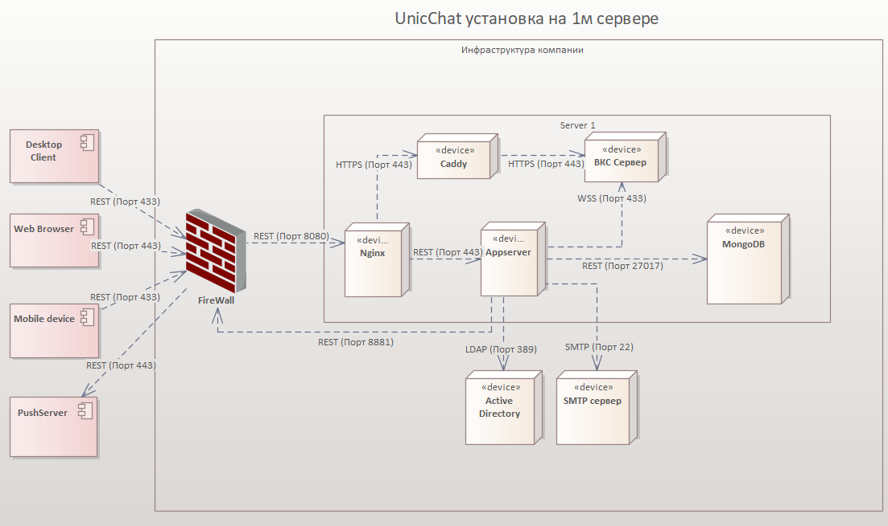
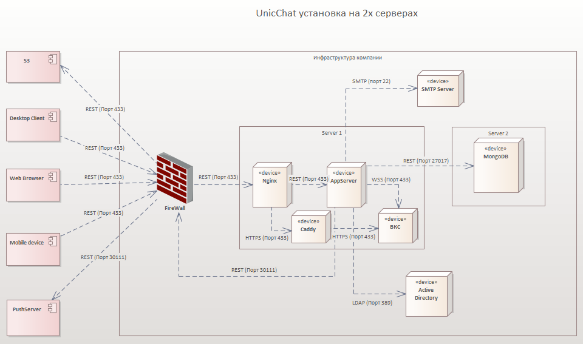

<!-- TOC --><a name="-unicchat"></a>
# Инструкция по установке корпоративного мессенджера для общения и командной работы UnicChat

версия документа 1.8

<!-- TOC --><a name=""></a>
## Оглавление

<!-- TOC start (generated with https://github.com/derlin/bitdowntoc) -->

- [Описание продукта](#-)
- [Скачать инструкции в PDF ](#-pdf)
- [Архитектура установки](#--1)
   * [Установка на 1-м сервере](#-1-)
   * [Установка на 2-х серверах (рекомендуется для промышленного использования)](#-2-)
- [Обязательные компоненты](#--2)
      + [Push шлюз](#push-)
      + [ВКС шлюз](#--3)
      + [Приложения UnicChat](#-unicchat-1)
- [Опциональные компоненты](#--4)
      + [SMTP сервер](#smtp-)
      + [LDAP сервер](#ldap-)
- [Шаг 1. Подготовка окружения](#-1--1)
   * [1.1 Требования к конфигурации](#11-)
      + [Требования к конфигурации на 20 пользователей. Приложение и БД устанавливаются на 1-й виртуальной машине](#-20-1-)
      + [Конфигурация виртуальной машины](#--5)
      + [Требования к конфигурации на 20-50 пользователей. Приложение и БД устанавливаются на разные виртуальные машины](#-20-50-)
      + [Конфигурация виртуальной машины для приложения](#--6)
      + [Конфигурация виртуальной машины для БД](#--7)
   * [1.2. Запрос лицензии для Unicchat Solid Core](#12-unicchat-solid-core)
   * [1.3. Клонирование репозитория](#13-)
   * [1.4 Зарегистрировать DNS имена](#14-dns-)
- [Шаг 2. Установка](#-2-install)
   * [Права и доступы, которые нужно выдать](#-2-perms)
   * [2.1 Установите Docker](#21-docker)
   * [2.2 Проверка поддержки AVX процессором](#22-avx-)
   * [2.3 Авторизация в Container Registry](#26-container-registry)
   * [2.4 Файл `.env`](#24-env)
   * [2.5 SSL-сертификаты (Certbot)](#25-certbot)
   * [2.6 Nginx](#26-nginx)
   * [2.7 Запуск](#27-unicchat)
   * [2.8 Проверка](#28-check)
   * [2.9 Открытие сетевых доступов и портов](#215-)
      + [Входящие соединения на сервере UnicChat](#-unicchat-2)
      + [Исходящие соединения](#--15)
- [Шаг 3. Установка локального медиа сервера для ВКС](#-3-)
- [Шаг 6. Создание пользователя администратора](#-6-)
- [Шаг 7. Настройка push-уведомлений](#-7-push-)
- [Опциональные компоненты](#--16)
   * [Шаг 8. Настройка redminebot](#-8-redminebot)
      + [8.1 Настройка redminebot](#81-redminebot)
      + [8.2 Подключение UnicChat к redminebot](#82-unicchat-redminebot)
   * [Важные замечания](#--17)
- [Клиентские приложения](#--18)

<!-- TOC end -->


<!-- TOC --><a name="-"></a>
## Описание продукта
* [Описание архитектуры UnicChat.pdf](https://github.com/unicommorg/unicchat.enterprise/blob/main/docs/%D0%9E%D0%BF%D0%B8%D1%81%D0%B0%D0%BD%D0%B8%D0%B5%20%D0%B0%D1%80%D1%85%D0%B8%D1%82%D0%B5%D0%BA%D1%82%D1%83%D1%80%D1%8B%20UnicChat.pdf)
* [Описание архитектуры UnicChat.docx](https://github.com/unicommorg/unicchat.enterprise/blob/main/docs/%D0%9E%D0%BF%D0%B8%D1%81%D0%B0%D0%BD%D0%B8%D0%B5%20%D0%B0%D1%80%D1%85%D0%B8%D1%82%D0%B5%D0%BA%D1%82%D1%83%D1%80%D1%8B%20UnicChat.docx)
* [UnicChat Описание продукта.pdf](https://github.com/unicommorg/unicchat.enterprise/blob/main/docs/UnicChat%20%D0%9E%D0%BF%D0%B8%D1%81%D0%B0%D0%BD%D0%B8%D0%B5%20%D0%BF%D1%80%D0%BE%D0%B4%D1%83%D0%BA%D1%82%D0%B0.pdf)
* [UnicChat Описание продукта.docx](https://github.com/unicommorg/unicchat.enterprise/blob/6b4b0d010ff633b9bdb9899a9a4d088150fd7f80/docs/UnicChat%20%D0%9E%D0%BF%D0%B8%D1%81%D0%B0%D0%BD%D0%B8%D0%B5%20%D0%BF%D1%80%D0%BE%D0%B4%D1%83%D0%BA%D1%82%D0%B0.docx)
<!-- TOC --><a name="-pdf"></a>
## Скачать инструкции в PDF 

Инструкции для unicchat лежат в репозитории [docs](https://github.com/unicommorg/unicchat.enterprise/tree/main/docs)

* [Инструкция пользователя UnicChat.pdf](https://github.com/unicommorg/unicchat.enterprise/blob/main/docs/%D0%98%D0%BD%D1%81%D1%82%D1%80%D1%83%D0%BA%D1%86%D0%B8%D1%8F%20%D0%BF%D0%BE%D0%BB%D1%8C%D0%B7%D0%BE%D0%B2%D0%B0%D1%82%D0%B5%D0%BB%D1%8F%20UnicChat.pdf)
* [Инструкция_по_администрированию_UnicChat.pdf](https://github.com/unicommorg/unicchat.enterprise/blob/main/docs/%D0%98%D0%BD%D1%81%D1%82%D1%80%D1%83%D0%BA%D1%86%D0%B8%D1%8F_%D0%BF%D0%BE_%D0%B0%D0%B4%D0%BC%D0%B8%D0%BD%D0%B8%D1%81%D1%82%D1%80%D0%B8%D1%80%D0%BE%D0%B2%D0%B0%D0%BD%D0%B8%D1%8E_UnicChat.pdf)
* [Инструкция_по_лицензированию_UnicChat.pdf](https://github.com/unicommorg/unicchat.enterprise/blob/main/docs/%D0%98%D0%BD%D1%81%D1%82%D1%80%D1%83%D0%BA%D1%86%D0%B8%D1%8F_%D0%BF%D0%BE_%D0%BB%D0%B8%D1%86%D0%B5%D0%BD%D0%B7%D0%B8%D1%80%D0%BE%D0%B2%D0%B0%D0%BD%D0%B8%D1%8E_UnicChat.pdf)

<!-- TOC --><a name="--1"></a>
## Архитектура установки

___

<!-- TOC --><a name="-1-"></a>
### Установка на 1-м сервере



<!-- TOC --><a name="-2-"></a>
### Установка на 2-х серверах (рекомендуется для промышленного использования)



<!-- TOC --><a name="--2"></a>
## Обязательные компоненты

___

<!-- TOC --><a name="push-"></a>
#### Push шлюз

Публичный сервис компании Unicomm. Подключение к нему необходимо для отправки push-сообщений на мобильные платформы Apple и Google.
Расположен во внешнем периметре на серверах компании. Серверу UnicChat требуются исходящие соединения к этому сервису и не требуются входящие соединения.

<!-- TOC --><a name="--3"></a>
#### ВКС шлюз

Публичный сервис компании Unicomm. Подключение к нему необходимо для работы аудио и видео конференций, а также аудио-звонков.
Расположены во внешнем периметре на серверах компании. Серверу UnicChat требуются исходящие соединения к этому сервису и не требуются входящие соединения.

<!-- TOC --><a name="-unicchat-1"></a>
#### Приложения UnicChat

Пользовательское приложение, установленное на iOS или Android платформе.
Сервер UnicChat должен иметь возможность принимать входящие сообщения от этих приложений, а также отправлять ответы.
Основное взаимодействие осуществляется через протокол HTTPS (443/TCP).
Для работы видео- и аудиозвонков необходимы протоколы STUN и TURN: входящие соединения на порты 7881/TCP и 7882/UDP, а также входящий и исходящий трафик UDP по портам 50000-60000 (RTP-трафик).

<!-- TOC --><a name="--4"></a>
## Опциональные компоненты

___

<!-- TOC --><a name="smtp-"></a>
#### SMTP сервер

Используется для отправки OTP-сообщений, восстановлений пароля, напоминания о пропущенных сообщениях, предоставляется вами.
Может быть использован как публичный, так и ваш собственный сервер. На схеме предполагается, что сервер находится в вашем сегменте DMZ.
**Интеграция с SMTP не является обязательным условием.**

<!-- TOC --><a name="ldap-"></a>
#### LDAP сервер

Используется для получения списка пользователей в системе. UnicChat может обслуживать как пользователей, заведенных в LDAP каталоге, так и внутренних пользователей в собственной базе. **Интеграция с LDAP не является обязательным условием**
#### 

<!-- TOC --><a name="-1--1"></a>
## Шаг 1. Подготовка окружения

<!-- TOC --><a name="11-"></a>
### 1.1 Требования к конфигурации

<!-- TOC --><a name="-20-1-"></a>
#### Требования к конфигурации на 20 пользователей. Приложение и БД устанавливаются на 1-й виртуальной машине

<!-- TOC --><a name="--5"></a>
#### Конфигурация виртуальной машины

```
CPU 4 cores 1.7ghz, с набором инструкций FMA3, SSE4.2, AVX 2.0;
RAM 8 Gb;
150 Gb HDD\SSD;
```

<!-- TOC --><a name="-20-50-"></a>
#### Требования к конфигурации на 20-50 пользователей. Приложение и БД устанавливаются на разные виртуальные машины

<!-- TOC --><a name="--6"></a>
#### Конфигурация виртуальной машины для приложения

```
CPU 4 cores 1.7ghz, с набором инструкций FMA3, SSE4.2;
RAM 8 Gb;
200 Gb HDD\SSD
```

<!-- TOC --><a name="--7"></a>
#### Конфигурация виртуальной машины для БД

```
CPU 4 cores 1.7ghz, с набором инструкций FMA3, SSE4.2, AVX 2.0;
RAM 8 Gb;
100 Gb HDD\SSD
```

<!-- TOC --><a name="12-unicchat-solid-core"></a>
### 1.2. Запрос лицензии для Unicchat Solid Core

Просим обратиться в компанию unicomm для выдачи лицензии Unicchat Solid Core


<!-- TOC --><a name="13-"></a>
### 1.3. Клонирование репозитория

1. Скачать при помощи `git` командой `git clone` файлы по https://github.com/unicommorg/unicchat.enterprise.git.
 Выполнить на сервере

```shell
git clone https://github.com/unicommorg/unicchat.enterprise.git
```
2. Либо клонируйте репозиторий иным способом.

<!-- TOC --><a name="14-dns-"></a>
### 1.4 Зарегистрировать DNS имена

Перед началом работы запросите DNS-имена. Три имени обязаны указывать на IP сервера, где будет `docker compose` (порты 80/443).

Имена ниже — примеры. Подставьте свои в `multi-server-install/.env`.

| Назначение | Переменная в `.env` | Пример |
|------------|---------------------|--------|
| Веб-интерфейс UnicChat | `APP_SERVER_NAME` | `myapp.unic.chat` |
| MinIO (S3) | `MINIO_SERVER_NAME` | `myminio.unic.chat` |
| DocumentServer | `DOCUMENTSERVER_SERVER_NAME` | `myedt.unic.chat` |

1. UnicChat (основной сервис мессенджера)
* **myapp.unic.chat** (`APP_SERVER_NAME`)

   **Назначение**: адрес, через который пользователи открывают веб-интерфейс. HTTPS, WebSocket.

2. Хранение и редактирование документов
* **myminio.unic.chat** (`MINIO_SERVER_NAME`)

   **Назначение**: S3-совместимое хранилище файлов и документов. Бакеты `unicchat-files` и `uc.onlyoffice.docs` создаёт init-контейнер `minio-init`. Консоль MinIO слушает порт 9002 на хосте.

* **myedt.unic.chat** (`DOCUMENTSERVER_SERVER_NAME`)

   **Назначение**: DocumentServer для совместного редактирования документов.

MinIO и DocumentServer в едином compose ходят друг к другу по именам контейнеров (`unicchat-minio`, `unicchat-documentserver`). Записи в `/etc/hosts` на этом сервере не нужны.

3. Медиасервер ВКС (ставится отдельно, шаг 3)
* **mylk-yc.unic.chat** — ВКС-шлюз
* **turn.mylk-yc.unic.chat** — TURN
* **whip.mylk-yc.unic.chat** — WHIP

<!-- TOC --><a name="-2-install"></a>
## Шаг 2. Установка

Установка идёт из каталога `multi-server-install/` одним файлом `docker-compose.yml` и одним `.env`. Сеть `unicchat-network`, пользователи MongoDB (vault/tasker/logger), секрет Vault `KBTConfigs` и бакеты MinIO создаются init-контейнерами — руками это делать не нужно.

Состав стека: `unicchat-mongodb`, `unicchat-vault`, `unicchat-appserver`, `unicchat-logger`, `unicchat-tasker`, `unicchat-nginx`, `unicchat-minio`, `unicchat-documentserver` (плюс PostgreSQL и RabbitMQ для DocumentServer) и init-контейнеры `vault-mongo-init`, `vault-init`, `minio-init`.

Перед установкой нужна действующая лицензия UnicChat Solid Core (раздел 1.2). Без неё система не заработает корректно.

<!-- TOC --><a name="-2-perms"></a>
### Права и доступы, которые нужно выдать

Без этого `compose up` или выпуск сертификатов не дойдут до конца. Раздайте заранее.

**На сервере (ОС)**

| Кому | Зачем |
|------|--------|
| Пользователь в группе `sudo` | Установка Docker, `ufw`, правки системных лимитов |
| Тот же пользователь в группе `docker` | `docker compose` и `docker login` без `sudo` (`sudo usermod -aG docker $USER`, затем перелогин) |
| Право слушать порты 80 и 443 | Certbot standalone и nginx. На время выпуска сертификатов эти порты должны быть свободны |
| Запись в каталог установки | `multi-server-install/.env`, `nginx/conf.d/`. Certbot пишет в `certs/` от root — каталог должен существовать, после выпуска ключи остаются `root:root` (nginx в контейнере читает их как root, этого достаточно) |

**Сеть и DNS**

| Что | Зачем |
|-----|--------|
| A-записи трёх имён на публичный IP этого хоста | Let's Encrypt HTTP-01 и доступ пользователей |
| Входящие **80/tcp, 443/tcp** с интернета (firewall, security group, NAT) | Сертификаты и HTTPS. Без 80 certbot не выпустит сертификат |
| Входящий **9002/tcp** — по необходимости | Консоль MinIO, не обязателен снаружи |
| Исходящий **443/tcp** на `cr.yandex` | `docker pull` образов |
| Исходящий **80/tcp и 443/tcp** на Let's Encrypt (`acme-v02.api.letsencrypt.org`) | Выпуск и продление сертификатов |
| Исходящий **443/tcp** на `push1.unic.chat` | Лицензия и push |

**Реестр образов**

Нужен `docker login` в `cr.yandex` с oauth-токеном (команда в п. 2.3). Токен даёт **pull** образов UnicChat. Push в registry для установки не нужен. Если login проходит, а `pull` отвечает `denied` — токену не хватает прав на репозитории `crps*` / `crpi*` / `crpst*`.

**Лицензия**

Действующая лицензия UnicChat Solid Core от Unicomm (п. 1.2). Без неё контейнеры поднимутся, продукт — нет.

<!-- TOC --><a name="21-docker"></a>
### 2.1 Установите Docker

Установите Docker Engine и плагин Compose по официальной документации: https://docs.docker.com/engine/install/

```shell
docker --version
docker compose version
sudo systemctl enable --now docker
docker info
```

Порты 80 и 443 на хосте должны быть свободны до выпуска сертификатов и до запуска nginx.

<!-- TOC --><a name="22-avx-"></a>
### 2.2 Проверка поддержки AVX процессором

В текущем `docker-compose.yml` используется MongoDB 4.4 — набор AVX не обязателен. Проверка на будущее (MongoDB 5.x и выше AVX требуют):

```shell
grep avx /proc/cpuinfo
```

- Есть строки с `avx` — процессор подойдёт и для MongoDB 5.x+.
- Пустой вывод — оставляйте 4.4, как в compose.

<!-- TOC --><a name="26-container-registry"></a>
### 2.3 Авторизация в Container Registry

Образы лежат в Yandex Container Registry. Логин тот же, что был в скрипте развёртывания:

```shell
docker login --username oauth \
  --password-stdin \
  cr.yandex <<< "y0__wgBEPrL67wHGMHdEyD7rJmMGCeDEOXSuqJalbFdb2Dgucs0mlmU"
```

Проверка: `docker pull` любого образа из `cr.yandex/crpst6ndtaf70or2n2bb/` не должен спрашивать пароль повторно.

<!-- TOC --><a name="24-env"></a>
### 2.4 Файл `.env`

```shell
cd unicchat.enterprise/multi-server-install
cp .env.example .env
```

Заполните домены и пароли. Обязательно:

- Три DNS: `APP_SERVER_NAME`, `DOCUMENTSERVER_SERVER_NAME`, `MINIO_SERVER_NAME` — те же имена, что в DNS, и те же, для которых ниже выпускаются сертификаты.
- `ROOT_URL=https://<APP_SERVER_NAME>`
- `LICENSE_HOST=https://push1.unic.chat/`
- Пути к сертификатам уже в формате `/certs/config/live/<домен>/fullchain.pem` и `privkey.pem`. После смены домена поправьте и три пары: `SSL_CERT`/`SSL_KEY`, `DOCUMENTSERVER_SSL_*`, `MINIO_SSL_*`.

Пароли подставляются в MongoDB URI **без URL-кодирования**. Используйте только `[A-Za-z0-9_-]`, без `@ : / ? & %` и пробелов.

Файл `.env` в git не коммитится.

<!-- TOC --><a name="25-certbot"></a>
### 2.5 SSL-сертификаты (Certbot)

Нужны **три отдельных** сертификата Let's Encrypt (по одному на домен) в `./certs/config/live/<домен>/`. Nginx монтирует `./certs` в `/certs`, поэтому пути в `.env` совпадают с тем, что пишет certbot при таком монтировании.

Порты 80/443 в этот момент должны быть свободны (nginx ещё не запущен). DNS A-записи уже должны указывать на этот сервер.

```shell
cd ~/unicchat.enterprise/multi-server-install
set -a && . ./.env && set +a
mkdir -p certs/config certs/logs certs/work

EMAIL=admin@example.com

run_cert() {
  docker run --rm -it \
    -p 80:80 \
    -v "$(pwd)/certs/config:/etc/letsencrypt" \
    -v "$(pwd)/certs/logs:/var/log/letsencrypt" \
    -v "$(pwd)/certs/work:/var/lib/letsencrypt" \
    certbot/certbot certonly --standalone \
    --agree-tos -m "$EMAIL" --non-interactive \
    -d "$1"
}

run_cert "$APP_SERVER_NAME"
run_cert "$DOCUMENTSERVER_SERVER_NAME"
run_cert "$MINIO_SERVER_NAME"
```

Подставьте свой `EMAIL`. Домены берутся из `.env`, в команде их хардкодить не нужно.

Продление:

```shell
cd ~/unicchat.enterprise/multi-server-install
docker run --rm \
  -p 80:80 \
  -v "$(pwd)/certs/config:/etc/letsencrypt" \
  -v "$(pwd)/certs/logs:/var/log/letsencrypt" \
  -v "$(pwd)/certs/work:/var/lib/letsencrypt" \
  certbot/certbot renew --non-interactive

docker compose exec unicchat-nginx nginx -s reload
```

Для `renew` порт 80 должен быть доступен снаружи. Если nginx уже слушает 80, остановите его на время renew (`docker compose stop unicchat-nginx`) либо используйте webroot — в базовой установке достаточно остановить nginx, обновить сертификаты и снова `docker compose start unicchat-nginx`.

<!-- TOC --><a name="26-nginx"></a>
### 2.6 Nginx

Три шаблона в `nginx/templates/` содержат плейсхолдеры (`${APP_SERVER_NAME}`, `${SSL_CERT}`, `${DOCUMENTSERVER_SERVER_NAME}`, `${MINIO_SERVER_NAME}` и остальные). При старте контейнера `unicchat-nginx` штатный `envsubst` подставляет значения из `.env` и пишет:

| Файл на хосте | Домен |
|---------------|--------|
| `nginx/conf.d/00-app.conf` | `APP_SERVER_NAME` |
| `nginx/conf.d/10-documentserver.conf` | `DOCUMENTSERVER_SERVER_NAME` |
| `nginx/conf.d/20-minio.conf` | `MINIO_SERVER_NAME` |

Каталог `nginx/conf.d/` смонтирован в контейнер: файлы видны с хоста.

Смена домена или пути к сертификату — правка `.env` (и соответствующих `SSL_*`), затем:

```shell
docker compose up -d --force-recreate unicchat-nginx
```

Разовая отладка без пересоздания контейнера:

```shell
nano nginx/conf.d/00-app.conf
docker compose exec unicchat-nginx nginx -t
docker compose exec unicchat-nginx nginx -s reload
```

Такая правка живёт до следующего пересоздания контейнера. Постоянные изменения держите в `nginx/templates/` и в `.env`.

<!-- TOC --><a name="27-unicchat"></a>
### 2.7 Запуск

```shell
cd ~/unicchat.enterprise/multi-server-install
docker compose pull
docker compose up -d --wait
```

`--wait` дождётся healthcheck appserver и mongodb; nginx стартует после healthy appserver.

Логи:

```shell
docker compose ps
docker compose logs -f --tail=100
```

<!-- TOC --><a name="28-check"></a>
### 2.8 Проверка

```shell
cd ~/unicchat.enterprise/multi-server-install
set -a && . ./.env && set +a

curl -sI "http://${APP_SERVER_NAME}"
curl -skI "https://${APP_SERVER_NAME}"
curl -skI "https://${DOCUMENTSERVER_SERVER_NAME}"
curl -skI "https://${MINIO_SERVER_NAME}"
```

HTTP на приложении должен ответить **301** на HTTPS. HTTPS — страница входа / setup-wizard. Откройте `https://<APP_SERVER_NAME>` в браузере и пройдите мастер (шаг 6).

Если сайт не открывается сразу — инкогнито, Ctrl+F5, кэш.

<!-- TOC --><a name="215-"></a>
### 2.9 Открытие сетевых доступов и портов

Для корректной работы UnicChat необходимо открыть следующие порты и доступы:

<!-- TOC --><a name="-unicchat-2"></a>
#### Входящие соединения на сервере UnicChat

Откройте порты в firewall:

```shell
# Для HTTP/HTTPS (Nginx)
sudo ufw allow 80/tcp
sudo ufw allow 443/tcp

# Для MinIO Console
sudo ufw allow 9002/tcp

# Для ВКС (если устанавливается локальный медиа-сервер)
sudo ufw allow 7881/tcp
sudo ufw allow 7882/udp
sudo ufw allow 50000:60000/udp
```

Проверьте статус firewall:
```shell
sudo ufw status
```

<!-- TOC --><a name="--15"></a>
#### Исходящие соединения

Убедитесь, что сервер UnicChat может устанавливать исходящие соединения:

**Для Push-шлюза:**
- 443/TCP на хост **push1.unic.chat**

**Для ВКС-сервера:**
Примечание: **lk-yc.unic.chat** — адрес внешней ВКС компании Unicomm. При развертывании локального медиа-сервера используйте свой адрес.
- 443/TCP на хост **lk-yc.unic.chat**
- 7881/TCP, 7882/UDP
- (50000-60000)/UDP (диапазон портов может быть изменён при развертывании лицензионной версии)

**Для опциональных компонентов:**
- LDAP (обычно 389/TCP или 636/TCP для LDAPS)
- SMTP (обычно 25/TCP, 465/TCP или 587/TCP)
- DNS (53/TCP и 53/UDP)

<!-- TOC --><a name="-3-"></a>
## Шаг 3. Установка локального медиа сервера для ВКС

Подробная инструкция также доступна в **веб-версии** или **в репозитории**:
*   🔗 **Веб:** [github.com/unicommorg/unicchat.enterprise/blob/main/vcs.unic.chat.template/readme.first.md](https://github.com/unicommorg/unicchat.enterprise/blob/main/vcs.unic.chat.template/readme.first.md)
*   📁 **Локальный путь:** `./vcs.unic.chat.template/readme.first.md`

---

<!-- TOC --><a name="-6-"></a>
## Шаг 6. Создание пользователя администратора

* `Name` - Имя пользователя, которое будет отображаться в чате;
* `Username` - Логин пользователя, который вы будете указывать для авторизации;
* `Email` - Действующая почта, используется для восстановления
* `Organization Name` - Краткое название вашей организации латинскими буквами без пробелов и спец. символов, используется для регистрации push уведомлений. Может быть указан позже;
* `Organization ID` - Идентификатор вашей организации, используется для подключения к push серверу. Может быть указан позже. Для получения ID необходимо написать запрос с указанием значения в Organization Name на почту support@unicomm.pro;
* `Password` - пароль вашего пользователя;
* `Confirm your password` - подтверждение пароля;

1. После создания пользователя, авторизоваться в веб-интерфейсе с использованием ранее указанных параметров.
2. Для включения пушей, перейти в раздел Администрирование - Push. Включить использование шлюза и указать адрес шлюза https://push1.unic.chat
3. Перейти в раздел Администрирование - Organization, убедиться что поля заполнены в соответствии с вашими данными.
4. Настройка завершена.

При первом входе может возникнуть информационное предупреждение


Нажмите "ДА"

<!-- TOC --><a name="-7-push-"></a>
## Шаг 7. Настройка push-уведомлений

Приложение Unicchat работает с внешним push сервером для доставки push-уведомлений в приложение Unicchat на мобильные устройства.

<!-- TOC --><a name="--16"></a>
## Опциональные компоненты

**Примечание:** секрет Vault `KBTConfigs` создаёт init-контейнер `vault-init` при `docker compose up`. Отдельно настраивать Vault для KBT не нужно.

<!-- TOC --><a name="-8-redminebot"></a>
### Шаг 8. Настройка redminebot

Redminebot - это опциональный сервис для интеграции с системой отслеживания задач Redmine.

<!-- TOC --><a name="81-redminebot"></a>
#### 8.1 Настройка redminebot

Перейдите в директорию redminebot:
```shell
cd redminebot
```

Проверьте файл `redminebot.yml`. По умолчанию он настроен для работы с Vault, но **необходимо изменить сеть** на `unicchat-network`:

```yaml
version: "3.7"
networks:
  unicchat-network:
    external: true
services:
  ucredminebot:
    image: cr.yandex/crpi5ll6mqcn793fvu9i/unic/unicchatbotredmine:prod
    container_name: ucredminebot
    ports:
      - 8201:8080
    environment:
      - Vault__Host=http://unicchat-vault:80
    restart: always
    networks:
      - unicchat-network
```

**Настройка переменной окружения Vault__Host:**

Возможные варианты подключения к Vault:

1. **По имени сервиса Docker** (если redminebot и Vault в одной сети):
   ```
   Vault__Host=http://unicchat-vault:80
   ```

2. **По внутреннему IP-адресу сервера** (если на разных серверах):
   ```
   Vault__Host=http://10.0.X.X:8200
   ```
   где `10.0.X.X` - IP-адрес сервера с Vault

3. **По доменному имени** (если настроен DNS):
   ```
   Vault__Host=http://vault.example.com:8200
   ```

Отредактируйте файл при необходимости:
```shell
nano redminebot.yml
```

Запустите redminebot:
```bash
docker compose -f redminebot.yml up -d
```

Проверьте запуск:
```bash
docker ps | grep ucredminebot
docker logs ucredminebot
```

<!-- TOC --><a name="82-unicchat-redminebot"></a>
#### 8.2 Подключение UnicChat к redminebot

Если redminebot запущен, необходимо добавить его адрес в конфигурацию AppServer.

Отредактируйте файл `multi-server-install/docker-compose.yml`:
```bash
cd ../multi-server-install/
nano docker-compose.yml
```

Найдите секцию `unicchat-appserver` и добавьте переменную `REDMINE_BOT_HOST` в `environment`:

```yaml
    environment:
      CREATE_TOKENS_FOR_USERS: true
      MONGODB_HOST: ${MONGODB_HOST}
      # ... остальные переменные без изменений ...
      REDMINE_BOT_HOST: http://ucredminebot:8080
```

**Возможные значения REDMINE_BOT_HOST:**

1. **Если redminebot в той же Docker-сети:**
   ```yaml
   REDMINE_BOT_HOST: http://ucredminebot:8080
   ```

2. **Если на другом сервере (по IP):**
   ```yaml
   REDMINE_BOT_HOST: http://10.0.X.X:8201
   ```

3. **Если по доменному имени:**
   ```yaml
   REDMINE_BOT_HOST: http://redminebot.example.com:8201
   ```

Перезапустите AppServer:
```bash
docker compose restart unicchat-appserver
```

Проверьте логи:
```bash
docker logs unicchat-appserver | grep -i redmine
```
<!-- TOC --><a name="--17"></a>
### Важные замечания

- Убедитесь, что все IP-адреса и учетные данные заменены на реальные значения
- Убедитесь, что порт 8201 не занят другими приложениями
- Пользователи MongoDB для vault/tasker/logger создаются init-контейнером `vault-mongo-init`

<!-- TOC --><a name="--18"></a>
## Клиентские приложения

* [Репозитории клиентских приложений]
* Android: (https://play.google.com/store/apps/details?id=pro.unicomm.unic.chat&pcampaignid=web_share)
* iOS: (https://apps.apple.com/ru/app/unicchat/id1665533885)
* Desktop: (https://github.com/unicommorg/unic.chat.desktop.releases/releases)
