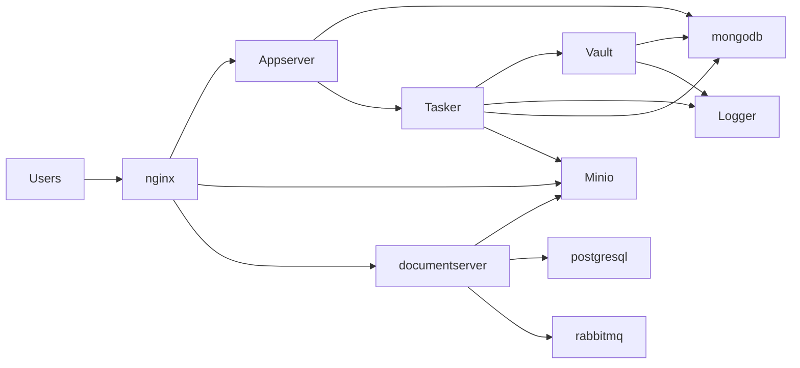

<!-- TOC --><a name="-unicchat"></a>
# Инструкция по установке корпоративного мессенджера для общения и командной работы UnicChat

версия документа 1.17

<!-- TOC --><a name=""></a>
## Оглавление

<!-- TOC start (generated with https://github.com/derlin/bitdowntoc) -->

- [Описание продукта](#-)
- [Скачать инструкции в PDF ](#-pdf)
- [Архитектура установки](#--1)
   * [Установка на 1-м сервере](#-1-)
   * [Установка на 2-х серверах (рекомендуется для промышленного использования)](#-2-)
   * [Варианты развёртывания](#-deploy-modes)
   * [Установка на отдельных серверах](#-multi-host)
- [Обязательные компоненты](#--2)
      + [Push шлюз](#push-)
      + [ВКС шлюз](#--3)
      + [Приложения UnicChat](#-unicchat-1)
- [Опциональные компоненты](#--4)
      + [SMTP сервер](#smtp-)
      + [LDAP сервер](#ldap-)
- [Шаг 1. Подготовка окружения](#-1--1)
   * [1.1 Требования к конфигурации](#11-)
      + [Требования к конфигурации на 20 пользователей. Приложение и БД устанавливаются на 1-й виртуальной машине](#-20-1-)
      + [Конфигурация виртуальной машины](#--5)
      + [Требования к конфигурации на 20-50 пользователей. Приложение и БД устанавливаются на разные виртуальные машины](#-20-50-)
      + [Конфигурация виртуальной машины для приложения](#--6)
      + [Конфигурация виртуальной машины для БД](#--7)
   * [1.2. Запрос лицензии UnicChat](#12-unicchat)
   * [1.3. Клонирование репозитория](#13-)
   * [1.4 Зарегистрировать DNS имена](#14-dns-)
- [Шаг 2. Установка на одном сервере](#-2-install)
   * [Права и доступы, которые нужно выдать](#-2-perms)
   * [2.1 Установите Docker](#21-docker)
   * [2.2 Проверка поддержки AVX процессором](#22-avx-)
   * [2.3 Авторизация в Container Registry](#26-container-registry)
   * [2.4 Файл `.env`](#24-env)
      + [Свои секреты и учётные данные](#24-secrets)
   * [2.5 SSL-сертификаты](#25-certbot)
   * [2.6 Nginx](#26-nginx)
   * [2.7 Запуск](#27-unicchat)
   * [2.8 Проверка](#28-check)
   * [2.9 Открытие сетевых доступов и портов](#215-)
      + [Входящие соединения на сервере UnicChat](#-unicchat-2)
      + [Исходящие соединения](#--15)
- [Шаг 2a. Установка на отдельных серверах](#-2a-multi)
   * [Что запускать на сервере](#-2a-role)
   * [Состав серверов](#-2a-map)
   * [Файлы ролей](#-2a-roles)
   * [Общий `.env` и адреса](#-2a-env)
   * [Порядок запуска](#-2a-order)
   * [Секрет Vault KBTConfigs](#-2a-vault)
   * [Nginx и сертификаты](#-2a-nginx)
   * [Частые ошибки](#-2a-troubles)
- [Шаг 3. Установка локального медиа сервера для ВКС](#-3-)
- [Шаг 6. Создание пользователя администратора](#-6-)
- [Шаг 7. Настройка push-уведомлений](#-7-push-)
- [Опциональные компоненты](#--16)
   * [Шаг 8. Настройка redminebot](#-8-redminebot)
      + [8.1 Настройка redminebot](#81-redminebot)
      + [8.2 Подключение UnicChat к redminebot](#82-unicchat-redminebot)
   * [Важные замечания](#--17)
- [Клиентские приложения](#--18)

<!-- TOC end -->


<!-- TOC --><a name="-"></a>
## Описание продукта
* [Описание архитектуры UnicChat.pdf](https://github.com/unicommorg/unicchat.enterprise/blob/main/docs/%D0%9E%D0%BF%D0%B8%D1%81%D0%B0%D0%BD%D0%B8%D0%B5%20%D0%B0%D1%80%D1%85%D0%B8%D1%82%D0%B5%D0%BA%D1%82%D1%83%D1%80%D1%8B%20UnicChat.pdf)
* [Описание архитектуры UnicChat.docx](https://github.com/unicommorg/unicchat.enterprise/blob/main/docs/%D0%9E%D0%BF%D0%B8%D1%81%D0%B0%D0%BD%D0%B8%D0%B5%20%D0%B0%D1%80%D1%85%D0%B8%D1%82%D0%B5%D0%BA%D1%82%D1%83%D1%80%D1%8B%20UnicChat.docx)
* [UnicChat Описание продукта.pdf](https://github.com/unicommorg/unicchat.enterprise/blob/main/docs/UnicChat%20%D0%9E%D0%BF%D0%B8%D1%81%D0%B0%D0%BD%D0%B8%D0%B5%20%D0%BF%D1%80%D0%BE%D0%B4%D1%83%D0%BA%D1%82%D0%B0.pdf)
* [UnicChat Описание продукта.docx](https://github.com/unicommorg/unicchat.enterprise/blob/6b4b0d010ff633b9bdb9899a9a4d088150fd7f80/docs/UnicChat%20%D0%9E%D0%BF%D0%B8%D1%81%D0%B0%D0%BD%D0%B8%D0%B5%20%D0%BF%D1%80%D0%BE%D0%B4%D1%83%D0%BA%D1%82%D0%B0.docx)
<!-- TOC --><a name="-pdf"></a>
## Скачать инструкции в PDF 

Инструкции для UnicChat лежат в репозитории [docs](https://github.com/unicommorg/unicchat.enterprise/tree/main/docs)

* [Инструкция пользователя UnicChat.pdf](https://github.com/unicommorg/unicchat.enterprise/blob/main/docs/%D0%98%D0%BD%D1%81%D1%82%D1%80%D1%83%D0%BA%D1%86%D0%B8%D1%8F%20%D0%BF%D0%BE%D0%BB%D1%8C%D0%B7%D0%BE%D0%B2%D0%B0%D1%82%D0%B5%D0%BB%D1%8F%20UnicChat.pdf)
* [Инструкция_по_администрированию_UnicChat.pdf](https://github.com/unicommorg/unicchat.enterprise/blob/main/docs/%D0%98%D0%BD%D1%81%D1%82%D1%80%D1%83%D0%BA%D1%86%D0%B8%D1%8F_%D0%BF%D0%BE_%D0%B0%D0%B4%D0%BC%D0%B8%D0%BD%D0%B8%D1%81%D1%82%D1%80%D0%B8%D1%80%D0%BE%D0%B2%D0%B0%D0%BD%D0%B8%D1%8E_UnicChat.pdf)
* [Инструкция_по_лицензированию_UnicChat.pdf](https://github.com/unicommorg/unicchat.enterprise/blob/main/docs/%D0%98%D0%BD%D1%81%D1%82%D1%80%D1%83%D0%BA%D1%86%D0%B8%D1%8F_%D0%BF%D0%BE_%D0%BB%D0%B8%D1%86%D0%B5%D0%BD%D0%B7%D0%B8%D1%80%D0%BE%D0%B2%D0%B0%D0%BD%D0%B8%D1%8E_UnicChat.pdf)

<!-- TOC --><a name="--1"></a>
## Архитектура установки

___

<!-- TOC --><a name="-1-"></a>
### Установка на 1-м сервере


<!-- TOC --><a name="-2-"></a>
### Установка на 2-х серверах (рекомендуется для промышленного использования)


На рисунках — состав серверов. Команды запуска: [шаг 2](#-2-install) для одного сервера и [шаг 2a](#-2a-multi) для установки на отдельных серверах.

<!-- TOC --><a name="-deploy-modes"></a>
### Варианты развёртывания

| Сценарий | Где описан | Что запускать |
|----------|------------|----------------|
| Все сервисы на одном сервере | [шаг 2](#-2-install) | `docker compose up -d` из каталога `multi-server-install/` |
| Сервисы на отдельных серверах | [шаг 2a](#-2a-multi) | на каждом сервере свой `compose.<роль>.yml` |

<!-- TOC --><a name="-multi-host"></a>
### Установка на отдельных серверах

| Сервер | Команда |
|--------|---------|
| MongoDB | `docker compose -f compose.mongodb.yml up -d` |
| Vault | `docker compose -f compose.vault.yml up -d` |
| Logger | `docker compose -f compose.logger.yml up -d` |
| MinIO | `docker compose -f compose.minio.yml up -d` |
| Tasker | `docker compose -f compose.tasker.yml up -d` |
| Knowledgebase | `docker compose -f compose.knowledgebase.yml up -d` |
| AppServer | `docker compose -f compose.appserver.yml up -d` |
| Nginx | `docker compose -f compose.nginx.yml up -d` |


```mermaid
flowchart LR
  Users[Users] --> Nginx[nginx]
  Nginx --> Appserver
  Nginx --> Minio
  Nginx --> Docs[documentserver]
  Appserver --> Mongo[mongodb]
  Appserver --> Tasker
  Tasker --> Vault
  Tasker --> Logger
  Tasker --> Mongo
  Tasker --> Minio
  Docs --> Minio
  Docs --> Pg[postgresql]
  Docs --> Rabbit[rabbitmq]
  Vault --> Mongo
  Vault --> Logger
```

Подробности — [шаг 2a](#-2a-multi).

<!-- TOC --><a name="--2"></a>
## Обязательные компоненты

___

<!-- TOC --><a name="push-"></a>
#### Push шлюз

Шлюз Unicomm отправляет push-уведомления на телефоны iOS и Android. С сервера UnicChat откройте исходящий 443/tcp на `push1.unic.chat`. Входящие порты для этого шлюза не открывайте.

<!-- TOC --><a name="--3"></a>
#### ВКС шлюз

Шлюз Unicomm нужен для аудио- и видеозвонков, если локальный медиасервер (шаг 3) не ставите. С сервера UnicChat откройте исходящие порты на `lk-yc.unic.chat` — список в п. 2.9. Входящие порты для внешнего шлюза не открывайте.

<!-- TOC --><a name="-unicchat-1"></a>
#### Приложения UnicChat

Пользовательское приложение, установленное на iOS или Android платформе.
Сервер UnicChat должен иметь возможность принимать входящие сообщения от этих приложений, а также отправлять ответы.
Основное взаимодействие осуществляется через протокол HTTPS (443/TCP).
Для работы видео- и аудиозвонков необходимы протоколы STUN и TURN: входящие соединения на порты 7881/TCP и 7882/UDP, а также входящий и исходящий трафик UDP по портам 50000-60000 (RTP-трафик).

<!-- TOC --><a name="--4"></a>
## Опциональные компоненты

___

<!-- TOC --><a name="smtp-"></a>
#### SMTP сервер

Используется для отправки OTP-сообщений, восстановления пароля, напоминания о пропущенных сообщениях, предоставляется вами.
Может быть использован как публичный, так и ваш собственный сервер. На схеме предполагается, что сервер находится в вашем сегменте DMZ.
**Интеграция с SMTP не является обязательным условием.**

<!-- TOC --><a name="ldap-"></a>
#### LDAP сервер

Используется для получения списка пользователей в системе. UnicChat может обслуживать как пользователей, заведённых в LDAP-каталоге, так и внутренних пользователей в собственной базе. **Интеграция с LDAP не является обязательным условием.**

<!-- TOC --><a name="-1--1"></a>
## Шаг 1. Подготовка окружения

<!-- TOC --><a name="11-"></a>
### 1.1 Требования к конфигурации

<!-- TOC --><a name="-20-1-"></a>
#### Требования к конфигурации на 20 пользователей. Приложение и БД устанавливаются на 1-й виртуальной машине

<!-- TOC --><a name="--5"></a>
#### Конфигурация виртуальной машины

```
CPU 4 cores 1.7ghz, с набором инструкций FMA3, SSE4.2, AVX 2.0;
RAM 8 Gb;
150 Gb HDD\SSD;
```

<!-- TOC --><a name="-20-50-"></a>
#### Требования к конфигурации на 20-50 пользователей. Приложение и БД устанавливаются на разные виртуальные машины

<!-- TOC --><a name="--6"></a>
#### Конфигурация виртуальной машины для приложения

```
CPU 4 cores 1.7ghz, с набором инструкций FMA3, SSE4.2;
RAM 8 Gb;
200 Gb HDD\SSD
```

<!-- TOC --><a name="--7"></a>
#### Конфигурация виртуальной машины для БД

```
CPU 4 cores 1.7ghz, с набором инструкций FMA3, SSE4.2, AVX 2.0;
RAM 8 Gb;
100 Gb HDD\SSD
```

<!-- TOC --><a name="12-unicchat"></a>
### 1.2. Запрос лицензии UnicChat

> **До начала установки запросите в компании Unicomm лицензию на продукт UnicChat.** Лицензия одна на всю установку.
>
> **Без неё контейнеры запустятся, но продукт работать не будет.** Сервер проверяет лицензию по адресу `LICENSE_HOST` в `.env` (по умолчанию `https://push1.unic.chat/`). Откройте исходящий 443/tcp на этот адрес.


<!-- TOC --><a name="13-"></a>
### 1.3. Клонирование репозитория

1. Скачать при помощи `git` командой `git clone` файлы по https://github.com/unicommorg/unicchat.enterprise.git.
 Выполнить на сервере

```shell
git clone https://github.com/unicommorg/unicchat.enterprise.git
```
2. Либо клонируйте репозиторий иным способом.

<!-- TOC --><a name="14-dns-"></a>
### 1.4 Зарегистрировать DNS имена

Перед началом работы запросите DNS-имена. Имена ниже — примеры. Подставьте свои в `multi-server-install/.env`.

| Назначение | Переменная в `.env` | Пример |
|------------|---------------------|--------|
| Веб-интерфейс UnicChat | `APP_SERVER_NAME` | `myapp.unic.chat` |
| MinIO (S3) | `MINIO_SERVER_NAME` | `myminio.unic.chat` |
| DocumentServer | `DOCUMENTSERVER_SERVER_NAME` | `myedt.unic.chat` |

На одном сервере все три A-записи указывают на IP этой машины (порты 80/443). На отдельных серверах A-записи указывают на сервер роли Nginx.

1. UnicChat (основной сервис мессенджера)
* **myapp.unic.chat** (`APP_SERVER_NAME`)

   **Назначение**: адрес, через который пользователи открывают веб-интерфейс. HTTPS, WebSocket.

2. Хранение и редактирование документов
* **myminio.unic.chat** (`MINIO_SERVER_NAME`)

   **Назначение**: S3-совместимое хранилище файлов и документов. Бакеты создаёт init-контейнер `minio-init`. Консоль MinIO слушает порт 9002 на хосте MinIO (с интернета открывать не обязательно).

* **myedt.unic.chat** (`DOCUMENTSERVER_SERVER_NAME`)

   **Назначение**: DocumentServer для совместного редактирования документов.

3. Медиасервер ВКС (ставится отдельно, шаг 3)
* **mylk-yc.unic.chat** — ВКС-шлюз
* **turn.mylk-yc.unic.chat** — TURN
* **whip.mylk-yc.unic.chat** — WHIP

<!-- TOC --><a name="-2-install"></a>
## Шаг 2. Установка на одном сервере

Каталог `multi-server-install/`, файл `docker-compose.yml`, один `.env`. Пользователи БД, секрет Vault `KBTConfigs` и бакеты MinIO создаются init-контейнерами при первом запуске.

Перед установкой получите в Unicomm лицензию на продукт UnicChat (раздел 1.2).

<!-- TOC --><a name="-2-perms"></a>
### Права и доступы, которые нужно выдать

**На сервере (ОС)**

| Кому | Зачем |
|------|--------|
| Пользователь в группе `sudo` | Установка Docker, `ufw`, правки системных лимитов |
| Тот же пользователь в группе `docker` | `docker compose` и `docker login` без `sudo` (`sudo usermod -aG docker $USER`, затем перелогин) |
| Право слушать порты 80 и 443 | Certbot и контейнер nginx |
| Запись в каталог установки | `multi-server-install/.env`, `certs/`, `nginx/conf.d/` |

**Сеть и DNS**

| Что | Зачем |
|-----|--------|
| A-записи трёх имён — см. таблицу в п. 1.4 | HTTPS и выпуск сертификатов |
| Входящие **80/tcp, 443/tcp** | Certbot HTTP-01 и доступ пользователей |
| Входящий **9002/tcp** — по необходимости | Консоль MinIO |
| Исходящий **443/tcp** на `cr.yandex` | `docker pull` |
| Исходящий **80/tcp и 443/tcp** на Let's Encrypt (`acme-v02.api.letsencrypt.org`) | Выпуск и продление сертификатов |
| Исходящий **443/tcp** на `push1.unic.chat` | Лицензия и push |

**Лицензия**

Лицензия на продукт UnicChat от Unicomm (п. 1.2). Для проверки нужен исходящий 443/tcp на `push1.unic.chat`.

<!-- TOC --><a name="21-docker"></a>
### 2.1 Установите Docker

Установите Docker Engine и плагин Compose по официальной документации: https://docs.docker.com/engine/install/

```shell
docker --version
docker compose version
sudo systemctl enable --now docker
docker info
```

Порты 80 и 443 на хосте должны быть свободны до выпуска сертификатов и до запуска nginx.

<!-- TOC --><a name="22-avx-"></a>
### 2.2 Проверка поддержки AVX процессором

В `.env` указан образ MongoDB 4.4 (`IMAGE_MONGODB`). Для него AVX не нужен. Перед сменой образа на MongoDB 5 или новее проверьте процессор:

```shell
grep avx /proc/cpuinfo
```

- Есть строки с `avx` — процессор подойдёт и для MongoDB 5.x+.
- Пустой вывод — оставляйте 4.4, как в `.env` (`IMAGE_MONGODB`).

<!-- TOC --><a name="26-container-registry"></a>
### 2.3 Авторизация в Container Registry

Образы лежат в Yandex Container Registry. Войдите в реестр:

```shell
docker login --username oauth \
  --password-stdin \
  cr.yandex <<< "y0__wgBEPrL67wHGMHdEyD7rJmMGCeDEOXSuqJalbFdb2Dgucs0mlmU"
```

<!-- TOC --><a name="24-env"></a>
### 2.4 Файл `.env`

```shell
cd unicchat.enterprise/multi-server-install
cp .env.example .env
```

Значения `change_me_*` замените своими паролями. Теги образов — переменные `IMAGE_*`; на всех серверах они одинаковые.

<!-- TOC --><a name="24-secrets"></a>
#### Свои секреты и учётные данные

Задайте **свои** пароли и имена служебных пользователей. Не оставляйте значения из `.env.example` и не используйте одни и те же пароли на разных площадках.

Обязательно замените:

| Переменная | Зачем |
|------------|--------|
| `MONGODB_ROOT_PASSWORD` | root MongoDB |
| `MONGODB_PASSWORD` | пользователь приложения (`MONGODB_USERNAME`) |
| `VAULT_DB_PASSWORD` | БД Vault |
| `LOGGER_DB_PASSWORD` | БД Logger |
| `TASKER_DB_PASSWORD` | БД Tasker / базы знаний |
| `MINIO_ROOT_USER` / `MINIO_ROOT_PASSWORD` | S3; попадут в секрет Vault `KBTConfigs` |

Имена служебных пользователей (`MONGODB_USERNAME`, `VAULT_DB_USER`, `LOGGER_DB_USER`, `TASKER_DB_USER`, `MINIO_ROOT_USER`) тоже лучше задать свои, а не оставлять из примера.

Пример генерации (алфавит совместим с MongoDB URI — только `[A-Za-z0-9_-]`):

```shell
gen() { openssl rand -base64 32 | tr -d '/+=' | cut -c1-24; }
echo "MONGODB_ROOT_PASSWORD=$(gen)"
echo "MONGODB_PASSWORD=$(gen)"
echo "VAULT_DB_PASSWORD=$(gen)"
echo "LOGGER_DB_PASSWORD=$(gen)"
echo "TASKER_DB_PASSWORD=$(gen)"
echo "MINIO_ROOT_PASSWORD=$(gen)"
```

Подставьте вывод в `.env`. Пароли в URI MongoDB **без URL-кодирования**: не используйте `@ : / ? & %` и пробелы.

После первого запуска смена паролей в `.env` сама по себе БД и секрет `KBTConfigs` не обновит.

Заполните домены:

- `APP_SERVER_NAME`, `DOCUMENTSERVER_SERVER_NAME`, `MINIO_SERVER_NAME` — те же имена, что в DNS.
- `ROOT_URL=https://<APP_SERVER_NAME>`
- `LICENSE_HOST=https://push1.unic.chat/`
- Пути `SSL_CERT` / `SSL_KEY`, `DOCUMENTSERVER_SSL_*`, `MINIO_SSL_*` — `/certs/config/live/<домен>/fullchain.pem` и `privkey.pem`.
- Адреса сервисов оставьте как в `.env.example` (имена контейнеров). На отдельных серверах их меняют на IP — таблица в [шаге 2a](#-2a-multi).

Секрет `KBTConfigs` создаёт `vault-init` один раз. Если после первого запуска меняются адреса MongoDB или MinIO для Tasker — [п. «Секрет Vault KBTConfigs»](#-2a-vault).

<!-- TOC --><a name="25-certbot"></a>
### 2.5 SSL-сертификаты

Nginx берёт `fullchain.pem` и `privkey.pem` из `./certs/config/live/<домен>/`. Пути к файлам — `SSL_CERT`, `SSL_KEY`, `DOCUMENTSERVER_SSL_*` и `MINIO_SSL_*` в `.env`. Каталог `./certs` подключается в контейнер как `/certs`.

Требование одно: три домена (`APP_SERVER_NAME`, `DOCUMENTSERVER_SERVER_NAME`, `MINIO_SERVER_NAME`) должны открываться по HTTPS с сертификатом доверенного удостоверяющего центра. Чем именно терминируется TLS — контейнером `unicchat-nginx`, вашим nginx или балансировщиком — установка не диктует.

Выберите один способ.

| Способ | Когда подходит | Что запускать |
|--------|----------------|---------------|
| Let's Encrypt, проверка HTTP-01 | домены смотрят на этот сервер, порты 80 и 443 свободны | Certbot + `unicchat-nginx` |
| Let's Encrypt, проверка DNS-01 | порт 80 из интернета закрыт | Certbot + `unicchat-nginx` |
| Готовые файлы сертификатов | сертификат выпущен внутренним УЦ организации или закуплен у коммерческого УЦ | только `unicchat-nginx` |
| Свой nginx на хосте | на сервере уже есть настроенный nginx | ни Certbot, ни `unicchat-nginx` |
| Балансировщик или реверс-прокси перед сервером | TLS терминируется снаружи | ни Certbot, ни `unicchat-nginx` |

Самоподписанный сертификат для продуктивной установки не подходит: мобильные и десктопные клиенты его отклонят. Он годится только для тестового контура, где корневой сертификат заранее разложен на все устройства.

**Let's Encrypt, проверка HTTP-01.** Имена из `.env` уже указывают на этот сервер. Порты 80 и 443 свободны. Выпустите три сертификата, по одному на каждый домен.

```shell
cd ~/unicchat.enterprise/multi-server-install
set -a && . ./.env && set +a
mkdir -p certs/config certs/logs certs/work

run_cert() {
  docker run --rm \
    -p 80:80 \
    -v "$(pwd)/certs/config:/etc/letsencrypt" \
    -v "$(pwd)/certs/logs:/var/log/letsencrypt" \
    -v "$(pwd)/certs/work:/var/lib/letsencrypt" \
    certbot/certbot certonly --standalone \
    --agree-tos --register-unsafely-without-email --non-interactive \
    -d "$1"
}

run_cert "$APP_SERVER_NAME"
run_cert "$DOCUMENTSERVER_SERVER_NAME"
run_cert "$MINIO_SERVER_NAME"
```

Домены берутся из `.env`.

Продление:

```shell
cd ~/unicchat.enterprise/multi-server-install
docker compose stop unicchat-nginx
docker run --rm \
  -p 80:80 \
  -v "$(pwd)/certs/config:/etc/letsencrypt" \
  -v "$(pwd)/certs/logs:/var/log/letsencrypt" \
  -v "$(pwd)/certs/work:/var/lib/letsencrypt" \
  certbot/certbot renew --non-interactive
docker compose start unicchat-nginx
```

На сервере роли Nginx те же команды с `-f compose.nginx.yml`.

**Let's Encrypt, проверка DNS-01.** Подходит, когда порт 80 из интернета закрыт: Let's Encrypt проверяет владение доменом через TXT-запись, а не через обращение на сервер. Файлы складываются в тот же каталог `certs/config/`.

```shell
cd ~/unicchat.enterprise/multi-server-install
set -a && . ./.env && set +a

docker run --rm -it \
  -v "$(pwd)/certs/config:/etc/letsencrypt" \
  -v "$(pwd)/certs/logs:/var/log/letsencrypt" \
  -v "$(pwd)/certs/work:/var/lib/letsencrypt" \
  certbot/certbot certonly --manual --preferred-challenges dns \
  --agree-tos --register-unsafely-without-email \
  -d "$APP_SERVER_NAME" -d "$DOCUMENTSERVER_SERVER_NAME" -d "$MINIO_SERVER_NAME"
```

Certbot по очереди попросит создать TXT-запись `_acme-challenge.<домен>` для каждого имени и дождаться её появления в DNS. Получится один сертификат с тремя именами в `certs/config/live/<APP_SERVER_NAME>/` — укажите этот путь во всех трёх парах переменных `SSL_*`, `DOCUMENTSERVER_SSL_*` и `MINIO_SSL_*`. Продление в режиме `--manual` тоже ручное: если у вашего DNS-провайдера есть плагин Certbot, используйте его вместо `--manual`, тогда продление автоматизируется.

**Готовые файлы сертификатов.** Подходит для сертификата коммерческого УЦ, внутреннего УЦ вашей организации или любого другого доверенного центра. Certbot не запускайте.

1. Получите сертификат обычным для вашего УЦ путём. Если нужен CSR, сформируйте его на этом сервере:

   ```shell
   openssl req -new -newkey rsa:2048 -nodes \
     -keyout privkey.pem -out request.csr \
     -subj "/CN=<домен>/O=<организация>/C=RU"
   ```

   Ключ `privkey.pem` с сервера не отдавайте, в УЦ уходит только `request.csr`. Для трёх доменов нужны либо три сертификата, либо один с SAN на все три имени.
2. Соберите `fullchain.pem`: сначала сертификат сервера, затем промежуточные сертификаты УЦ, каждый блок `BEGIN/END CERTIFICATE` с новой строки. Корневой сертификат добавлять не обязательно.
3. Положите `fullchain.pem` и `privkey.pem` в `certs/config/live/<домен>/` для каждого из трёх доменов. Пути в `.env` оставьте как в `.env.example`.
4. Проверьте, что цепочка полная и файлы совпадают друг с другом:

   ```shell
   openssl verify -untrusted certs/config/live/<домен>/fullchain.pem \
     certs/config/live/<домен>/fullchain.pem
   openssl x509 -noout -modulus -in certs/config/live/<домен>/fullchain.pem | openssl md5
   openssl rsa  -noout -modulus -in certs/config/live/<домен>/privkey.pem  | openssl md5
   ```

   Две последние команды должны дать одинаковую сумму. Если промежуточных сертификатов в `fullchain.pem` нет, браузер сайт откроет, а мобильные клиенты — нет.

Если сертификат выпускает внутренний УЦ организации, корневой сертификат этого УЦ должен быть заранее установлен на рабочих станциях и телефонах пользователей. Иначе клиентские приложения соединение не примут, и настройками сервера это не лечится.

Один сертификат на все три имени (wildcard или SAN) тоже подходит: положите одну и ту же пару файлов и укажите её во всех трёх парах переменных — `SSL_*`, `DOCUMENTSERVER_SSL_*`, `MINIO_SSL_*`.

Каталог `certs/config/live/<домен>/` — только значение по умолчанию из `.env.example`. Пути внутри `./certs` произвольные, важно лишь, чтобы они совпадали с переменными в `.env`: контейнер видит этот каталог как `/certs`.

Срок действия отслеживает тот, кто выпустил сертификат. После замены файлов перезапустите nginx: `docker compose up -d --force-recreate nginx-config-init unicchat-nginx`.

**Свой nginx на хосте.** Контейнер `unicchat-nginx` не запускайте, сертификат и его продление настройте в своём nginx. Остальные контейнеры запускаются как обычно и слушают на хосте:

| Имя из `.env` | Куда проксировать с HTTPS 443 | Порт в контейнере | Что это |
|---------------|-------------------------------|-------------------|---------|
| `APP_SERVER_NAME` | `http://<сервер AppServer>:8080` | 3000 | AppServer |
| `DOCUMENTSERVER_SERVER_NAME` | `http://<сервер Knowledgebase>:8880` | 80 | DocumentServer |
| `MINIO_SERVER_NAME` | `http://<сервер MinIO>:9000` | 9000 | MinIO S3 API |

Порт 80 на всех трёх именах — редирект на 443. Если веб-сервер стоит на том же хосте, что Docker, в `proxy_pass` указывают `127.0.0.1`. Если на другой машине — IP серверов AppServer, Knowledgebase и MinIO, а порты 8080, 8880 и 9000 открывают только для адреса этого веб-сервера.

Готовые примеры конфигурации: `multi-server-install/nginx/examples/host/`. Обязательные требования к своей конфигурации:

- на AppServer: `proxy_http_version 1.1`, заголовки `Upgrade` и `Connection "upgrade"` для WebSocket, `client_max_body_size 100M`;
- заголовки `Host` и `X-Forwarded-Proto` во всех трёх виртуальных хостах;
- на DocumentServer дополнительно `X-Forwarded-Host` и `X-Forwarded-Port 443`, иначе он построит ссылки по внутреннему адресу;
- на MinIO: `client_max_body_size 0`, `proxy_buffering off` и `proxy_request_buffering off`, иначе не загрузятся крупные файлы;
- `ROOT_URL` в `.env` совпадает с `https://<APP_SERVER_NAME>`, который отдаёт ваш веб-сервер: приложение формирует по нему ссылки.

Переменные `SSL_*`, `DOCUMENTSERVER_SSL_*` и `MINIO_SSL_*` в этом варианте не используются — их читает только контейнер `unicchat-nginx`.

Compose публикует порты приложений на всех интерфейсах хоста, поэтому наружу оставьте открытыми только 443/tcp и 80/tcp, а остальные закройте межсетевым экраном (п. 2.9). Из внешней сети не должны быть доступны 8080, 8880, 9000, консоль MinIO 9002 (её открывают только администратору), MongoDB 27017, Vault 8200, Logger 8082, Tasker 8881, PostgreSQL и RabbitMQ. Эти порты открывают только между серверами установки.

**Балансировщик или реверс-прокси перед сервером.** Если пользователи открывают сайт на балансировщике, а не на портах 80 и 443 этого хоста, контейнер nginx и Certbot не запускайте. Сертификат остаётся на балансировщике, до серверов трафик идёт на те же порты 8080, 8880 и 9000 по таблице выше. Балансировщик должен передавать `Host`, `X-Forwarded-Proto` и заголовки WebSocket, а `ROOT_URL` в `.env` — совпадать с внешним HTTPS-адресом.

<!-- TOC --><a name="26-nginx"></a>
### 2.6 Nginx

Виртуальные хосты собираются из шаблонов `nginx/templates/` в `nginx/conf.d/`:

| Файл | Домен |
|------|--------|
| `nginx/conf.d/00-app.conf` | `APP_SERVER_NAME` |
| `nginx/conf.d/10-documentserver.conf` | `DOCUMENTSERVER_SERVER_NAME` |
| `nginx/conf.d/20-minio.conf` | `MINIO_SERVER_NAME` |

После смены домена или пути к сертификату обновите `.env` и пересоздайте конфигурацию:

```shell
docker compose up -d --force-recreate nginx-config-init unicchat-nginx
```

Постоянные правки держите в `nginx/templates/` и в `.env`.

<!-- TOC --><a name="27-unicchat"></a>
### 2.7 Запуск

```shell
cd ~/unicchat.enterprise/multi-server-install
docker compose pull
docker compose up -d
```

Дождитесь, пока контейнеры перейдут в состояние healthy:

```shell
docker compose up -d --wait unicchat-appserver unicchat-documentserver unicchat-logger unicchat-logger-postgres unicchat-minio unicchat-mongodb unicchat-nginx unicchat-postgresql unicchat-rabbitmq unicchat-tasker unicchat-vault
```

```shell
docker compose ps
docker compose logs -f --tail=100
```

Каждая команда `up -d` заново прогоняет init-контейнеры, поэтому в логах штатно появляются сообщения о том, что создавать уже нечего:

```
logger-postgres-init  | ERROR:  role "logger_user" already exists
logger-postgres-init  | ERROR:  database "logger_db" already exists
vault-mongo-init      | Vault user already exists, skipping
vault-mongo-init      | Tasker user already exists, skipping
vault-init            | KBTConfigs secret already exists.
```

Это результат повторного прогона одних и тех же идемпотентных шагов, а не сбой: пользователи, базы и секрет уже на месте, и повторный запуск их не портит. На состояние стека такие строки не влияют.

<!-- TOC --><a name="28-check"></a>
### 2.8 Проверка

```shell
cd ~/unicchat.enterprise/multi-server-install
set -a && . ./.env && set +a

curl -sI "http://${APP_SERVER_NAME}"
curl -skI "https://${APP_SERVER_NAME}"
curl -skI "https://${DOCUMENTSERVER_SERVER_NAME}"
curl -skI "https://${MINIO_SERVER_NAME}"
```

HTTP на приложении отвечает **301** на HTTPS. HTTPS — страница входа / setup-wizard. Откройте `https://<APP_SERVER_NAME>` и пройдите мастер (шаг 6).

Если страница не открывается сразу — инкогнито, Ctrl+F5.

<!-- TOC --><a name="215-"></a>
### 2.9 Открытие сетевых доступов и портов

<!-- TOC --><a name="-unicchat-2"></a>
#### Входящие соединения на сервере UnicChat

```shell
# Для HTTP/HTTPS (Nginx)
sudo ufw allow 80/tcp
sudo ufw allow 443/tcp

# Для MinIO Console
sudo ufw allow 9002/tcp

# Для ВКС (если устанавливается локальный медиа-сервер)
sudo ufw allow 7881/tcp
sudo ufw allow 7882/udp
sudo ufw allow 50000:60000/udp
```

```shell
sudo ufw status
```

<!-- TOC --><a name="--15"></a>
#### Исходящие соединения

**Для Push-шлюза:**
- 443/TCP на хост **push1.unic.chat**

**Для ВКС-сервера:**
Примечание: **lk-yc.unic.chat** — адрес внешней ВКС компании Unicomm. При развёртывании локального медиа-сервера используйте свой адрес.
- 443/TCP на хост **lk-yc.unic.chat**
- 7881/TCP, 7882/UDP
- (50000-60000)/UDP (при установке локального медиасервера диапазон можно сменить в его настройках)

**Для опциональных компонентов:**
- LDAP (обычно 389/TCP или 636/TCP для LDAPS)
- SMTP (обычно 25/TCP, 465/TCP или 587/TCP)
- DNS (53/TCP и 53/UDP)

<!-- TOC --><a name="-2a-multi"></a>
## Шаг 2a. Установка на отдельных серверах

На каждом сервере — свой файл роли из `multi-server-install/`:

`compose.mongodb.yml`, `compose.vault.yml`, `compose.logger.yml`, `compose.minio.yml`, `compose.tasker.yml`, `compose.knowledgebase.yml`, `compose.appserver.yml`, `compose.nginx.yml`.

На сервере запускаете только свой файл. Перед запуском: Docker, `docker login` в `cr.yandex`, каталог `multi-server-install/`, общий `.env` (пароли и `IMAGE_*` одинаковые, адреса — IP соседей).

<!-- TOC --><a name="-2a-role"></a>
### Что запускать на сервере

На каждом сервере один файл compose. По нему видно, какие контейнеры здесь работают: MongoDB — `compose.mongodb.yml`, Nginx — `compose.nginx.yml`.

Адреса соседних серверов запишите в `.env`. Кто к какому порту ходит — в таблице портов ниже и на схеме в разделе «Установка на отдельных серверах».

<!-- TOC --><a name="-2a-map"></a>
### Состав серверов

| Сервер | Файл | Сервисы |
|--------|------|---------|
| **MongoDB** | `compose.mongodb.yml` | `unicchat-mongodb`, `vault-mongo-init` |
| **Vault** | `compose.vault.yml` | `unicchat-vault`, `vault-init` |
| **Logger** | `compose.logger.yml` | `unicchat-logger` |
| **MinIO** | `compose.minio.yml` | `unicchat-minio`, `minio-init` |
| **Tasker** | `compose.tasker.yml` | `unicchat-tasker` |
| **Knowledgebase** | `compose.knowledgebase.yml` | `unicchat-documentserver`, `unicchat-postgresql`, `unicchat-rabbitmq` |
| **AppServer** | `compose.appserver.yml` | `unicchat-appserver` |
| **Nginx** | `compose.nginx.yml` | `unicchat-nginx`, `nginx-config-init` |

В команде `up -d` достаточно имени файла. Контейнеры перечислять не нужно.

Пример IP:

| Сервер (роль) | IP |
|------|-----|
| MongoDB | `10.0.10.11` |
| Vault | `10.0.10.12` |
| Logger | `10.0.10.13` |
| MinIO | `10.0.10.14` |
| Tasker | `10.0.10.15` |
| Knowledgebase | `10.0.10.16` |
| AppServer | `10.0.10.17` |
| Nginx | `10.0.10.18` |

Порты, которые роль публикует на хосте. Их открывайте между серверами:

| Роль | Порт на хосте | Внутри контейнера | Кто ходит |
|------|---------------|-------------------|-----------|
| MongoDB | 27017 | 27017 | Vault, Tasker, AppServer |
| Vault | 8200 | 80 | Tasker, `vault-init` |
| Logger | 8082 | 8080 | Vault, Tasker |
| MinIO | 9000, 9002 | 9000, 9002 | Tasker, Knowledgebase, Nginx |
| Tasker | 8881 | 8080 | AppServer |
| Knowledgebase | 8880, 8443 | 80, 443 | Nginx (DocumentServer) |
| AppServer | 8080 | 3000 | Nginx |
| Nginx | 80, 443 | 80, 443 | пользователи |

В `.env` соседей указывают **порт на хосте**: Logger — `8082`, Tasker — `8881`, AppServer — `8080`, DocumentServer — `8880`.

<!-- TOC --><a name="-2a-roles"></a>
### Файлы ролей

```shell
cd multi-server-install
docker compose -f compose.mongodb.yml pull
docker compose -f compose.mongodb.yml up -d
```

Образы берутся из `IMAGE_*` в `.env`.

<!-- TOC --><a name="-2a-env"></a>
### Общий `.env` и адреса

`.env` один на всех серверах. Пароли и `IMAGE_*` совпадают. Вместо имён контейнеров из `.env.example` подставляют **IP соседа и порт на хосте**.

| Переменная | Один сервер | Отдельные серверы | Чей адрес |
|------------|-------------|-------------------|-----------|
| `MONGODB_HOST` | `unicchat-mongodb` | `10.0.10.11` | MongoDB |
| `MONGODB_ADVERTISED_HOSTNAME` | `unicchat-mongodb` | `10.0.10.11` | MongoDB |
| `API_VAULT_URL` | `http://unicchat-vault/` | `http://10.0.10.12:8200/` | Vault |
| `API_LOGGER_URL` | `http://unicchat-logger:8080/` | `http://10.0.10.13:8082/` | Logger |
| `UNIC_SOLID_HOST` | `http://unicchat-tasker:8080` | `http://10.0.10.15:8881` | Tasker |
| `KBT_MONGO_HOST` | `unicchat-mongodb` | `10.0.10.11` | MongoDB |
| `KBT_MINIO_HOST` | `unicchat-minio:9000` | `10.0.10.14:9000` | MinIO |
| `MINIO_HOST` | `unicchat-minio` | `10.0.10.14` | MinIO |
| `DOCUMENT_SERVER_PROXY` | `unicchat-documentserver` | `10.0.10.16:8880` | Knowledgebase |
| `UNICCHAT_HOST` | `unicchat-appserver` | `10.0.10.17` | AppServer |
| `NGINX_APP_PORT` | не задавать | `8080` | AppServer |
| `ROOT_URL` | `https://${APP_SERVER_NAME}` | `https://${APP_SERVER_NAME}` | не меняется |

`NGINX_APP_PORT` — хостовый порт AppServer. На одном сервере переменную не задают.

`DOCUMENT_SERVER_PROXY` на отдельных серверах указывают **с портом** `:8880`.

`KBT_MONGO_HOST` и `KBT_MINIO_HOST` попадают в секрет Vault `KBTConfigs`. Их задают **до** первого запуска `vault-init`.

| Роль | Какие переменные должны быть заполнены |
|------|----------------------------------------|
| MongoDB | `MONGODB_*` |
| Vault | `VAULT_DB_*`, `MONGODB_HOST`, `API_LOGGER_URL` |
| Logger | `LOGGER_DB_*`, `API_LOGGER_URL` |
| MinIO | `MINIO_ROOT_*`, `MINIO_BUCKET`, `MINIO_DOCS_BUCKET` |
| Tasker | `API_VAULT_URL`, `API_LOGGER_URL`, `TASKER_DB_*` |
| Knowledgebase | `DB_*`, `AMQP_URI`, `JWT_*` |
| AppServer | `MONGODB_*`, `UNIC_SOLID_HOST`, `ROOT_URL`, `LICENSE_HOST`, `DOCUMENTSERVER_SERVER_NAME` |
| Nginx | домены, `UNICCHAT_HOST`, `NGINX_APP_PORT`, `DOCUMENT_SERVER_PROXY`, `MINIO_HOST`, `MINIO_PORT`, пути к сертификатам |

`DB_HOST` и `AMQP_URI` не меняют: PostgreSQL и RabbitMQ DocumentServer живут на том же сервере, что и сам DocumentServer.

Сертификаты выпускают на сервере Nginx (п. 2.5).

<!-- TOC --><a name="-2a-order"></a>
### Порядок запуска

На каждом сервере:

```shell
docker compose -f compose.<роль>.yml pull
docker compose -f compose.<роль>.yml up -d
```

1. **MongoDB** — дождаться healthy, в логах `vault-mongo-init` пользователи созданы.
2. **Logger**.
3. **MinIO** — `minio-init`.
4. **Vault** — MongoDB и MinIO уже работают, иначе `vault-init` не создаст секрет. В `.env` уже IP в `KBT_*` и `API_LOGGER_URL`. В логах `vault-init`: `KBTConfigs secret created.`
5. **Tasker**.
6. **Knowledgebase**.
7. **AppServer**.
8. **Nginx** — сертификаты (п. 2.5), затем `compose.nginx.yml`.

Проверка — п. 2.8.

<!-- TOC --><a name="-2a-vault"></a>
### Секрет Vault KBTConfigs

Tasker берёт адрес MongoDB и доступ к MinIO из секрета Vault `KBTConfigs`. При первом запуске контейнер `vault-init` записывает секрет из `.env`:

| Что попадёт в секрет | Откуда в `.env` |
|----------------------|-----------------|
| строка подключения к MongoDB | `KBT_MONGO_HOST`, `TASKER_DB_USER`, `TASKER_DB_PASSWORD`, `TASKER_DB_NAME` |
| адрес MinIO | `KBT_MINIO_HOST` |
| логин и пароль MinIO | `MINIO_ROOT_USER`, `MINIO_ROOT_PASSWORD` |

На одном сервере оставьте значения из `.env.example`:

```
KBT_MONGO_HOST=unicchat-mongodb
KBT_MINIO_HOST=unicchat-minio:9000
```

На отдельных серверах возьмите адреса из таблицы выше: хост MongoDB и `хост MinIO:9000`.

Порядок запуска важен: MongoDB и MinIO должны быть подняты **до** Vault. Перед записью секрета `vault-init` сам проверяет, что адреса из `.env` отвечают, и повторяет проверку 10 раз с интервалом 5 секунд:

| Проверка | Адрес |
|----------|-------|
| MongoDB отвечает на порту 27017 | `KBT_MONGO_HOST` |
| MinIO отвечает на `/minio/health/live` | `KBT_MINIO_HOST` |

Если хотя бы один адрес недоступен, секрет **не создаётся**, `vault-init` завершается с ошибкой и пишет в лог:

```
MongoDB or MinIO is not reachable from vault-init. KBTConfigs secret NOT created.
Check KBT_MONGO_HOST and KBT_MINIO_HOST in .env, then start vault-init again.
```

В этом случае исправьте `KBT_MONGO_HOST` и `KBT_MINIO_HOST` (или поднимите нужный сервис) и запустите `vault-init` снова:

```shell
docker compose -f compose.vault.yml up --force-recreate vault-init
```

После записи `vault-init` перечитывает секрет и сверяет адреса с `.env`. Ожидаемый лог:

```
KBTConfigs secret created.
Secret matches .env: mongo=<KBT_MONGO_HOST> minio=<KBT_MINIO_HOST>
```

Ту же сверку `vault-init` делает, когда секрет уже существует. Готовый секрет он не перезаписывает: если адреса в Vault расходятся с `.env`, в лог попадает предупреждение, а установка продолжается.

```
WARNING: KBTConfigs in Vault does not match .env (expected mongo=..., minio=...).
WARNING: Tasker keeps the stored addresses. Recreate the secret by hand, see README, section 'Секрет Vault KBTConfigs'.
```

Так и задумано: решение, какие адреса правильные, остаётся за вами. Если верны значения из `.env` — удалите секрет и создайте заново (команды ниже), затем перезапустите Tasker. Если верны адреса в Vault — приведите `KBT_*` в `.env` к ним, чтобы предупреждение не повторялось.

Ещё две вещи проверьте вручную, `vault-init` их не контролирует:

- на сервере Tasker в `.env` указан тот же `API_VAULT_URL`, что и на сервере Vault;
- с сервера Tasker этот адрес Vault доступен по сети.

Посмотреть, какие адреса лежат в секрете (на сервере Vault):

```shell
TOKEN=$(docker run --rm --network unicchat-network curlimages/curl:8.8.0 \
  -fsS "http://unicchat-vault/api/token/0f8e160416b94225a73f86ac23b9118b?username=KBTservice")

docker run --rm --network unicchat-network curlimages/curl:8.8.0 \
  -sS -H "Authorization: Bearer ${TOKEN}" \
  "http://unicchat-vault/api/Secrets/KBTConfigs"
```

Адреса лежат в поле `metadata`: строка подключения `MongoCS` и `MinioHost`. Адрес в конце запроса указывайте без `/data`: по `.../KBTConfigs/data` вернётся только `{"data":"All info in META"}`, без адресов. В том же ответе открытым текстом приходят пароли Tasker и MinIO, поэтому вывод команды не пересылайте в переписке и не прикладывайте к заявкам.

Пересоздать после смены `KBT_*` в `.env`. Значения берутся из текущего файла, затем перезапустите Tasker:

```shell
set -a && . ./.env && set +a
TOKEN=$(docker run --rm --network unicchat-network curlimages/curl:8.8.0 \
  -fsS "http://unicchat-vault/api/token/0f8e160416b94225a73f86ac23b9118b?username=KBTservice")

docker run --rm --network unicchat-network curlimages/curl:8.8.0 \
  -sS -X DELETE -H "Authorization: Bearer ${TOKEN}" \
  "http://unicchat-vault/api/Secrets/KBTConfigs"

docker compose -f compose.vault.yml up --force-recreate vault-init
docker compose -f compose.vault.yml logs vault-init
```

На Tasker: `docker compose -f compose.tasker.yml restart unicchat-tasker`.

<!-- TOC --><a name="-2a-nginx"></a>
### Nginx и сертификаты

Сертификаты подготовьте по п. 2.5.

Если nginx ставите контейнером `compose.nginx.yml`:

1. Скопируйте тот же `.env`, что на остальных серверах. Укажите IP соседей: `UNICCHAT_HOST`, `NGINX_APP_PORT=8080`, `DOCUMENT_SERVER_PROXY=<адрес базы знаний>:8880`, `MINIO_HOST`.
2. Для Let's Encrypt освободите порты 80 и 443 и выпустите сертификаты (п. 2.5). Если файлы сертификатов уже лежат в `certs/config/live/`, Certbot не запускайте.
3. `docker compose -f compose.nginx.yml up -d`

После смены домена или пути к сертификату:

```shell
docker compose -f compose.nginx.yml up -d --force-recreate nginx-config-init unicchat-nginx
```

Если nginx уже установлен на этом сервере, `compose.nginx.yml` не запускайте: сертификат и правила проксирования настройте в своём nginx по п. 2.5. Единственное отличие от односерверной установки — в `proxy_pass` подставляют IP серверов AppServer, Knowledgebase и MinIO, а не `127.0.0.1`.

Если пользователи заходят на балансировщик, а не на порты 80 и 443 этого сервера, контейнер nginx и Certbot не запускайте (п. 2.5).

<!-- TOC --><a name="-2a-troubles"></a>
### Частые ошибки

| Симптом | Причина | Что сделать |
|---------|---------|-------------|
| `Bind for 0.0.0.0:8080 failed: port is already allocated` | на хосте уже занят `8080` | порты ролей: Logger `8082`, Tasker `8881`, AppServer `8080` |
| В логах AppServer `connect ECONNREFUSED ...:8080` на Tasker | в `UNIC_SOLID_HOST` внутренний порт, а Tasker опубликован на `8881` | `UNIC_SOLID_HOST=http://<tasker-host>:8881` |
| `vault-init`: `KBTConfigs secret NOT created` | с сервера Vault не отвечают `KBT_MONGO_HOST` или `KBT_MINIO_HOST` | поднять MongoDB и MinIO или исправить адреса, затем запустить `vault-init` заново |
| `vault-init`: `WARNING: KBTConfigs in Vault does not match .env` | секрет создан раньше с другими `KBT_*` | сверить адреса и при необходимости пересоздать секрет, затем перезапустить Tasker |
| Tasker не видит MongoDB или MinIO после правки `.env` | секрет `KBTConfigs` создан со старыми `KBT_*` | пересоздать секрет и перезапустить Tasker |
| Nginx отдаёт 502 на DocumentServer | `DOCUMENT_SERVER_PROXY` без порта | `DOCUMENT_SERVER_PROXY=<kb-host>:8880` |
| `WARN Found orphan containers ...` | несколько ролей в одном каталоге, общий project name | предупреждение безопасно; `--remove-orphans` не использовать |

<!-- TOC --><a name="-3-"></a>
## Шаг 3. Установка локального медиа сервера для ВКС

Подробная инструкция также доступна в **веб-версии** или **в репозитории**:
*   🔗 **Веб:** [github.com/unicommorg/unicchat.enterprise/blob/main/vcs.unic.chat.template/readme.first.md](https://github.com/unicommorg/unicchat.enterprise/blob/main/vcs.unic.chat.template/readme.first.md)
*   📁 **Локальный путь:** `./vcs.unic.chat.template/readme.first.md`

---

<!-- TOC --><a name="-6-"></a>
## Шаг 6. Создание пользователя администратора

* `Name` - Имя пользователя, которое будет отображаться в чате;
* `Username` - Логин пользователя, который вы будете указывать для авторизации;
* `Email` - Действующая почта, используется для восстановления
* `Organization Name` - Краткое название вашей организации латинскими буквами без пробелов и спец. символов, используется для регистрации push уведомлений. Может быть указан позже;
* `Organization ID` - Идентификатор вашей организации, используется для подключения к push серверу. Может быть указан позже. Для получения ID необходимо написать запрос с указанием значения в Organization Name на почту support@unicomm.pro;
* `Password` - пароль администратора. Задайте **свой**, длинный, только для этого контура; не используйте пароли из `.env` и не повторяйте пароль БД.
* `Confirm your password` - подтверждение пароля;

1. После создания пользователя войдите в веб-интерфейс с этим логином и паролем.
2. Откройте Администрирование — Push. Включите шлюз и укажите https://push1.unic.chat
3. Откройте Администрирование — Organization и проверьте, что поля совпадают с данными вашей организации.
4. Настройка завершена.

При первом входе может возникнуть информационное предупреждение


Нажмите "ДА"

<!-- TOC --><a name="-7-push-"></a>
## Шаг 7. Настройка push-уведомлений

Push на телефоны идёт через шлюз Unicomm. В веб-интерфейсе откройте Администрирование — Push, включите шлюз и укажите https://push1.unic.chat. На сервере должен быть открыт исходящий 443/tcp на этот адрес (п. 2.9). Идентификатор организации запросите у Unicomm: письмо на support@unicomm.pro с вашим Organization Name (шаг 6).

<!-- TOC --><a name="--16"></a>
## Опциональные компоненты

<!-- TOC --><a name="-8-redminebot"></a>
### Шаг 8. Настройка redminebot

Redminebot - это опциональный сервис для интеграции с системой отслеживания задач Redmine.

<!-- TOC --><a name="81-redminebot"></a>
#### 8.1 Настройка redminebot

Перейдите в директорию redminebot:
```shell
cd redminebot
```

Проверьте файл `redminebot.yml`. По умолчанию он настроен для работы с Vault, но **необходимо изменить сеть** на `unicchat-network`:

```yaml
version: "3.7"
networks:
  unicchat-network:
    external: true
services:
  ucredminebot:
    image: cr.yandex/crpi5ll6mqcn793fvu9i/unic/unicchatbotredmine:prod
    container_name: ucredminebot
    ports:
      - 8201:8080
    environment:
      - Vault__Host=http://unicchat-vault:80
    restart: always
    networks:
      - unicchat-network
```

**Настройка переменной окружения Vault__Host:**

Возможные варианты подключения к Vault:

1. **По имени сервиса Docker** (если redminebot и Vault в одной сети):
   ```
   Vault__Host=http://unicchat-vault:80
   ```

2. **По внутреннему IP-адресу сервера** (если на разных серверах):
   ```
   Vault__Host=http://10.0.X.X:8200
   ```
   где `10.0.X.X` - IP-адрес сервера с Vault

3. **По доменному имени** (если настроен DNS):
   ```
   Vault__Host=http://vault.example.com:8200
   ```

Отредактируйте файл при необходимости:
```shell
nano redminebot.yml
```

Запустите redminebot:
```bash
docker compose -f redminebot.yml up -d
```

Проверьте запуск:
```bash
docker ps | grep ucredminebot
docker logs ucredminebot
```

<!-- TOC --><a name="82-unicchat-redminebot"></a>
#### 8.2 Подключение UnicChat к redminebot

Добавьте адрес бота в конфигурацию AppServer.

На одном сервере — в `multi-server-install/docker-compose.yml`, секция `unicchat-appserver`. На сервере роли AppServer — в `compose.appserver.yml`.

```yaml
    environment:
      CREATE_TOKENS_FOR_USERS: true
      MONGODB_HOST: ${MONGODB_HOST}
      # ... остальные переменные без изменений ...
      REDMINE_BOT_HOST: http://ucredminebot:8080
```

**Возможные значения REDMINE_BOT_HOST:**

1. **Если redminebot в той же Docker-сети:**
   ```yaml
   REDMINE_BOT_HOST: http://ucredminebot:8080
   ```

2. **Если на другом сервере (по IP):**
   ```yaml
   REDMINE_BOT_HOST: http://10.0.X.X:8201
   ```

3. **Если по доменному имени:**
   ```yaml
   REDMINE_BOT_HOST: http://redminebot.example.com:8201
   ```

Перезапустите AppServer:

```bash
docker compose restart unicchat-appserver
```

На роли AppServer:

```bash
docker compose -f compose.appserver.yml restart unicchat-appserver
```

```bash
docker logs unicchat-appserver | grep -i redmine
```
<!-- TOC --><a name="--17"></a>
### Важные замечания

- Убедитесь, что все IP-адреса и учётные данные заменены на реальные значения
- Убедитесь, что порт 8201 не занят другими приложениями

<!-- TOC --><a name="--18"></a>
## Клиентские приложения

* [Репозитории клиентских приложений]
* Android: (https://play.google.com/store/apps/details?id=pro.unicomm.unic.chat&pcampaignid=web_share)
* iOS: (https://apps.apple.com/ru/app/unicchat/id1665533885)
* Desktop: (https://github.com/unicommorg/unic.chat.desktop.releases/releases)
