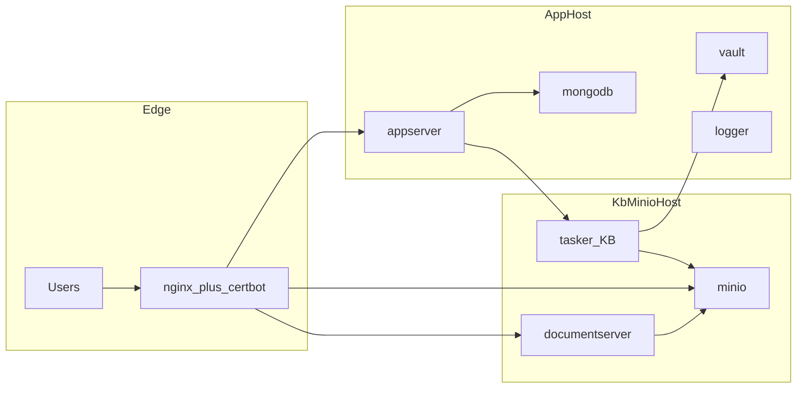

<!-- TOC --><a name="-unicchat"></a>
# Инструкция по установке корпоративного мессенджера для общения и командной работы UnicChat

версия документа 1.9

<!-- TOC --><a name=""></a>
## Оглавление

<!-- TOC start (generated with https://github.com/derlin/bitdowntoc) -->

- [Описание продукта](#-)
- [Скачать инструкции в PDF ](#-pdf)
- [Архитектура установки](#--1)
   * [Установка на 1-м сервере](#-1-)
   * [Установка на 2-х серверах (рекомендуется для промышленного использования)](#-2-)
   * [Варианты состава стека (A–D)](#--variants)
      + [A. Единый compose](#-a-unified)
      + [B. Внешний nginx и certbot](#-b-nginx)
      + [C. База знаний и MinIO отдельно](#-c-kb)
      + [D. Внешний edge и отдельная KB+MinIO](#-d-combined)
- [Обязательные компоненты](#--2)
      + [Push шлюз](#push-)
      + [ВКС шлюз](#--3)
      + [Приложения UnicChat](#-unicchat-1)
- [Опциональные компоненты](#--4)
      + [SMTP сервер](#smtp-)
      + [LDAP сервер](#ldap-)
- [Шаг 1. Подготовка окружения](#-1--1)
   * [1.1 Требования к конфигурации](#11-)
      + [Требования к конфигурации на 20 пользователей. Приложение и БД устанавливаются на 1-й виртуальной машине](#-20-1-)
      + [Конфигурация виртуальной машины](#--5)
      + [Требования к конфигурации на 20-50 пользователей. Приложение и БД устанавливаются на разные виртуальные машины](#-20-50-)
      + [Конфигурация виртуальной машины для приложения](#--6)
      + [Конфигурация виртуальной машины для БД](#--7)
   * [1.2. Запрос лицензии для Unicchat Solid Core](#12-unicchat-solid-core)
   * [1.3. Клонирование репозитория](#13-)
   * [1.4 Зарегистрировать DNS имена](#14-dns-)
- [Шаг 2. Установка](#-2-install)
   * [Права и доступы, которые нужно выдать](#-2-perms)
   * [2.1 Установите Docker](#21-docker)
   * [2.2 Проверка поддержки AVX процессором](#22-avx-)
   * [2.3 Авторизация в Container Registry](#26-container-registry)
   * [2.4 Файл `.env`](#24-env)
      + [Свои секреты и учётные данные](#24-secrets)
   * [2.5 SSL-сертификаты (Certbot)](#25-certbot)
   * [2.6 Nginx](#26-nginx)
   * [2.7 Запуск](#27-unicchat)
   * [2.8 Проверка](#28-check)
   * [2.9 Открытие сетевых доступов и портов](#215-)
      + [Входящие соединения на сервере UnicChat](#-unicchat-2)
      + [Исходящие соединения](#--15)
      + [Порты для вариантов B, C и D](#-ports-split)
   * [2.10 Вариант B — nginx и certbot снаружи](#210-external-nginx)
   * [2.11 Вариант C — база знаний и MinIO отдельно](#211-external-kb)
   * [2.12 Комбинация B+C](#212-combined)
      + [Диагностика split-установок](#-split-troubleshoot)
   * [2.13 Секрет Vault KBTConfigs на разных серверах](#213-vault-kbt)
- [Шаг 3. Установка локального медиа сервера для ВКС](#-3-)
- [Шаг 6. Создание пользователя администратора](#-6-)
- [Шаг 7. Настройка push-уведомлений](#-7-push-)
- [Опциональные компоненты](#--16)
   * [Шаг 8. Настройка redminebot](#-8-redminebot)
      + [8.1 Настройка redminebot](#81-redminebot)
      + [8.2 Подключение UnicChat к redminebot](#82-unicchat-redminebot)
   * [Важные замечания](#--17)
- [Клиентские приложения](#--18)

<!-- TOC end -->


<!-- TOC --><a name="-"></a>
## Описание продукта
* [Описание архитектуры UnicChat.pdf](https://github.com/unicommorg/unicchat.enterprise/blob/main/docs/%D0%9E%D0%BF%D0%B8%D1%81%D0%B0%D0%BD%D0%B8%D0%B5%20%D0%B0%D1%80%D1%85%D0%B8%D1%82%D0%B5%D0%BA%D1%82%D1%83%D1%80%D1%8B%20UnicChat.pdf)
* [Описание архитектуры UnicChat.docx](https://github.com/unicommorg/unicchat.enterprise/blob/main/docs/%D0%9E%D0%BF%D0%B8%D1%81%D0%B0%D0%BD%D0%B8%D0%B5%20%D0%B0%D1%80%D1%85%D0%B8%D1%82%D0%B5%D0%BA%D1%82%D1%83%D1%80%D1%8B%20UnicChat.docx)
* [UnicChat Описание продукта.pdf](https://github.com/unicommorg/unicchat.enterprise/blob/main/docs/UnicChat%20%D0%9E%D0%BF%D0%B8%D1%81%D0%B0%D0%BD%D0%B8%D0%B5%20%D0%BF%D1%80%D0%BE%D0%B4%D1%83%D0%BA%D1%82%D0%B0.pdf)
* [UnicChat Описание продукта.docx](https://github.com/unicommorg/unicchat.enterprise/blob/6b4b0d010ff633b9bdb9899a9a4d088150fd7f80/docs/UnicChat%20%D0%9E%D0%BF%D0%B8%D1%81%D0%B0%D0%BD%D0%B8%D0%B5%20%D0%BF%D1%80%D0%BE%D0%B4%D1%83%D0%BA%D1%82%D0%B0.docx)
<!-- TOC --><a name="-pdf"></a>
## Скачать инструкции в PDF 

Инструкции для unicchat лежат в репозитории [docs](https://github.com/unicommorg/unicchat.enterprise/tree/main/docs)

* [Инструкция пользователя UnicChat.pdf](https://github.com/unicommorg/unicchat.enterprise/blob/main/docs/%D0%98%D0%BD%D1%81%D1%82%D1%80%D1%83%D0%BA%D1%86%D0%B8%D1%8F%20%D0%BF%D0%BE%D0%BB%D1%8C%D0%B7%D0%BE%D0%B2%D0%B0%D1%82%D0%B5%D0%BB%D1%8F%20UnicChat.pdf)
* [Инструкция_по_администрированию_UnicChat.pdf](https://github.com/unicommorg/unicchat.enterprise/blob/main/docs/%D0%98%D0%BD%D1%81%D1%82%D1%80%D1%83%D0%BA%D1%86%D0%B8%D1%8F_%D0%BF%D0%BE_%D0%B0%D0%B4%D0%BC%D0%B8%D0%BD%D0%B8%D1%81%D1%82%D1%80%D0%B8%D1%80%D0%BE%D0%B2%D0%B0%D0%BD%D0%B8%D1%8E_UnicChat.pdf)
* [Инструкция_по_лицензированию_UnicChat.pdf](https://github.com/unicommorg/unicchat.enterprise/blob/main/docs/%D0%98%D0%BD%D1%81%D1%82%D1%80%D1%83%D0%BA%D1%86%D0%B8%D1%8F_%D0%BF%D0%BE_%D0%BB%D0%B8%D1%86%D0%B5%D0%BD%D0%B7%D0%B8%D1%80%D0%BE%D0%B2%D0%B0%D0%BD%D0%B8%D1%8E_UnicChat.pdf)

<!-- TOC --><a name="--1"></a>
## Архитектура установки

___

<!-- TOC --><a name="-1-"></a>
### Установка на 1-м сервере


<!-- TOC --><a name="-2-"></a>
### Установка на 2-х серверах (рекомендуется для промышленного использования)


Схемы 1VM/2VM задают **ёмкость** (приложение и БД на одной или разных машинах). Независимо от этого можно вынести reverse proxy и базу знаний — см. варианты A–D ниже.

<!-- TOC --><a name="--variants"></a>
### Варианты состава стека (A–D)

Шаг 2 по умолчанию — **вариант A**: один файл `multi-server-install/docker-compose.yml`, все сервисы на одном хосте. Варианты B–D — те же сервисы; какие блоки можно вынести, написано комментариями в compose и в п. 2.10–2.12. Отдельные YAML на каждый вариант не нужны.

<!-- TOC --><a name="-a-unified"></a>
#### A. Единый compose

Один хост (или app+DB по схемам выше): MongoDB, Vault, AppServer, Logger, Tasker (база знаний), nginx, MinIO, DocumentServer. Certbot — разовый контейнер в `./certs`. Это путь разделов 2.1–2.9.

<!-- TOC --><a name="-b-nginx"></a>
#### B. Внешний nginx и certbot

Порты 80/443 и Let’s Encrypt — на хосте или отдельной edge-VM (уже существующий nginx заказчика). Контейнер `unicchat-nginx` не запускается. См. [2.10](#210-external-nginx).

<!-- TOC --><a name="-c-kb"></a>
#### C. База знаний и MinIO отдельно

Tasker, MinIO и обычно DocumentServer — на другом хосте. AppServer смотрит в `UNIC_SOLID_HOST`, секрет Vault `KBTConfigs` — в `KBT_MINIO_HOST` / `KBT_MONGO_HOST`. См. [2.11](#211-external-kb).

<!-- TOC --><a name="-d-combined"></a>
#### D. Внешний edge и отдельная KB+MinIO

Комбинация B и C: типичный контур, если TLS уже терминируется на периметре, а объектное хранилище и база знаний живут отдельно. См. [2.12](#212-combined).


```mermaid
flowchart LR
  subgraph edge [Edge]
    Users[Users]
    Nginx[nginx_plus_certbot]
  end
  subgraph app [AppHost]
    Appserver[appserver]
    Mongo[mongodb]
    Vault[vault]
    Logger[logger]
  end
  subgraph kb [KbMinioHost]
    Tasker[tasker_KB]
    Minio[minio]
    Docs[documentserver]
  end
  Users --> Nginx
  Nginx --> Appserver
  Nginx --> Minio
  Nginx --> Docs
  Appserver --> Mongo
  Appserver --> Tasker
  Tasker --> Vault
  Tasker --> Minio
  Docs --> Minio
```

<!-- TOC --><a name="--2"></a>
## Обязательные компоненты

___

<!-- TOC --><a name="push-"></a>
#### Push шлюз

Публичный сервис компании Unicomm. Подключение к нему необходимо для отправки push-сообщений на мобильные платформы Apple и Google.
Расположен во внешнем периметре на серверах компании. Серверу UnicChat требуются исходящие соединения к этому сервису и не требуются входящие соединения.

<!-- TOC --><a name="--3"></a>
#### ВКС шлюз

Публичный сервис компании Unicomm. Подключение к нему необходимо для работы аудио и видео конференций, а также аудио-звонков.
Расположены во внешнем периметре на серверах компании. Серверу UnicChat требуются исходящие соединения к этому сервису и не требуются входящие соединения.

<!-- TOC --><a name="-unicchat-1"></a>
#### Приложения UnicChat

Пользовательское приложение, установленное на iOS или Android платформе.
Сервер UnicChat должен иметь возможность принимать входящие сообщения от этих приложений, а также отправлять ответы.
Основное взаимодействие осуществляется через протокол HTTPS (443/TCP).
Для работы видео- и аудиозвонков необходимы протоколы STUN и TURN: входящие соединения на порты 7881/TCP и 7882/UDP, а также входящий и исходящий трафик UDP по портам 50000-60000 (RTP-трафик).

<!-- TOC --><a name="--4"></a>
## Опциональные компоненты

___

<!-- TOC --><a name="smtp-"></a>
#### SMTP сервер

Используется для отправки OTP-сообщений, восстановлений пароля, напоминания о пропущенных сообщениях, предоставляется вами.
Может быть использован как публичный, так и ваш собственный сервер. На схеме предполагается, что сервер находится в вашем сегменте DMZ.
**Интеграция с SMTP не является обязательным условием.**

<!-- TOC --><a name="ldap-"></a>
#### LDAP сервер

Используется для получения списка пользователей в системе. UnicChat может обслуживать как пользователей, заведенных в LDAP каталоге, так и внутренних пользователей в собственной базе. **Интеграция с LDAP не является обязательным условием**
#### 

<!-- TOC --><a name="-1--1"></a>
## Шаг 1. Подготовка окружения

<!-- TOC --><a name="11-"></a>
### 1.1 Требования к конфигурации

<!-- TOC --><a name="-20-1-"></a>
#### Требования к конфигурации на 20 пользователей. Приложение и БД устанавливаются на 1-й виртуальной машине

<!-- TOC --><a name="--5"></a>
#### Конфигурация виртуальной машины

```
CPU 4 cores 1.7ghz, с набором инструкций FMA3, SSE4.2, AVX 2.0;
RAM 8 Gb;
150 Gb HDD\SSD;
```

<!-- TOC --><a name="-20-50-"></a>
#### Требования к конфигурации на 20-50 пользователей. Приложение и БД устанавливаются на разные виртуальные машины

<!-- TOC --><a name="--6"></a>
#### Конфигурация виртуальной машины для приложения

```
CPU 4 cores 1.7ghz, с набором инструкций FMA3, SSE4.2;
RAM 8 Gb;
200 Gb HDD\SSD
```

<!-- TOC --><a name="--7"></a>
#### Конфигурация виртуальной машины для БД

```
CPU 4 cores 1.7ghz, с набором инструкций FMA3, SSE4.2, AVX 2.0;
RAM 8 Gb;
100 Gb HDD\SSD
```

<!-- TOC --><a name="12-unicchat-solid-core"></a>
### 1.2. Запрос лицензии для Unicchat Solid Core

Просим обратиться в компанию unicomm для выдачи лицензии Unicchat Solid Core


<!-- TOC --><a name="13-"></a>
### 1.3. Клонирование репозитория

1. Скачать при помощи `git` командой `git clone` файлы по https://github.com/unicommorg/unicchat.enterprise.git.
 Выполнить на сервере

```shell
git clone https://github.com/unicommorg/unicchat.enterprise.git
```
2. Либо клонируйте репозиторий иным способом.

<!-- TOC --><a name="14-dns-"></a>
### 1.4 Зарегистрировать DNS имена

Перед началом работы запросите DNS-имена. Имена ниже — примеры. Подставьте свои в `multi-server-install/.env`.

| Назначение | Переменная в `.env` | Пример |
|------------|---------------------|--------|
| Веб-интерфейс UnicChat | `APP_SERVER_NAME` | `myapp.unic.chat` |
| MinIO (S3) | `MINIO_SERVER_NAME` | `myminio.unic.chat` |
| DocumentServer | `DOCUMENTSERVER_SERVER_NAME` | `myedt.unic.chat` |

Куда указывает A-запись, зависит от варианта установки. Пользователи всегда ходят на публичные имена по 443; внутренние порты Docker снаружи не публикуются, кроме как для edge/KB.

| Имя | A. Единый compose | B. Внешний nginx | C. KB+MinIO отдельно | D. B+C |
|-----|-------------------|------------------|----------------------|--------|
| `APP_SERVER_NAME` | IP хоста compose (80/443) | IP **edge** (nginx/certbot) | IP хоста приложения (встроенный nginx) | IP **edge** |
| `MINIO_SERVER_NAME` | тот же IP | IP **edge** | IP **KB/MinIO-хоста** (или его nginx) | IP **edge** |
| `DOCUMENTSERVER_SERVER_NAME` | тот же IP | IP **edge** | IP **KB-хоста** (рекомендуется вместе с MinIO) | IP **edge** |

1. UnicChat (основной сервис мессенджера)
* **myapp.unic.chat** (`APP_SERVER_NAME`)

   **Назначение**: адрес, через который пользователи открывают веб-интерфейс. HTTPS, WebSocket.

2. Хранение и редактирование документов
* **myminio.unic.chat** (`MINIO_SERVER_NAME`)

   **Назначение**: S3-совместимое хранилище файлов и документов. Бакеты `unicchat-files` и `uc.onlyoffice.docs` создаёт init-контейнер `minio-init`. Консоль MinIO слушает порт 9002 на хосте MinIO (не обязательна с интернета).

* **myedt.unic.chat** (`DOCUMENTSERVER_SERVER_NAME`)

   **Назначение**: DocumentServer для совместного редактирования документов.

В варианте A MinIO и DocumentServer ходят друг к другу по именам контейнеров (`unicchat-minio`, `unicchat-documentserver`). Записи в `/etc/hosts` на этом сервере не нужны. В вариантах C/D tasker на KB-хосте резолвит `unicchat-minio` в своей docker-сети; до MongoDB и Vault он ходит по IP app-хоста (`KBT_MONGO_HOST`, `API_VAULT_URL`).

3. Медиасервер ВКС (ставится отдельно, шаг 3)
* **mylk-yc.unic.chat** — ВКС-шлюз
* **turn.mylk-yc.unic.chat** — TURN
* **whip.mylk-yc.unic.chat** — WHIP

<!-- TOC --><a name="-2-install"></a>
## Шаг 2. Установка

Установка идёт из каталога `multi-server-install/` одним файлом `docker-compose.yml` и одним `.env`. Это **вариант A**. Сеть `unicchat-network`, пользователи MongoDB (vault/tasker/logger), секрет Vault `KBTConfigs` и бакеты MinIO создаются init-контейнерами — руками это делать не нужно.

Состав стека (блоки в `docker-compose.yml`):

| Блок | Сервисы | Можно вынести |
|------|---------|----------------|
| Ядро | MongoDB, Vault, AppServer, Logger (+ init) | нет, это хост приложения |
| Reverse proxy | `unicchat-nginx` | да — ваш nginx и certbot (вариант B) |
| База знаний и файлы | Tasker, MinIO, DocumentServer, PostgreSQL, RabbitMQ | да — отдельный хост (вариант C) |

Перед установкой нужна действующая лицензия UnicChat Solid Core (раздел 1.2). Без неё система не заработает корректно.

<!-- TOC --><a name="-2-perms"></a>
### Права и доступы, которые нужно выдать

Без этого `compose up` или выпуск сертификатов не дойдут до конца. Раздайте заранее.

**На сервере (ОС)**

| Кому | Зачем |
|------|--------|
| Пользователь в группе `sudo` | Установка Docker, `ufw`, правки системных лимитов |
| Тот же пользователь в группе `docker` | `docker compose` и `docker login` без `sudo` (`sudo usermod -aG docker $USER`, затем перелогин) |
| Право слушать порты 80 и 443 | Вариант A: certbot standalone и контейнер nginx. На время выпуска сертификатов эти порты должны быть свободны. Вариант B: 80/443 слушает **host** nginx/certbot, не Docker |
| Запись в каталог установки | `multi-server-install/.env`, `nginx/conf.d/`. Certbot пишет в `certs/` от root — каталог должен существовать, после выпуска ключи остаются `root:root` (nginx в контейнере читает их как root, этого достаточно) |

**Сеть и DNS**

| Что | Зачем |
|-----|--------|
| A-записи трёх имён — см. таблицу в п. 1.4 | Let's Encrypt HTTP-01 на хосте, который слушает 80, и доступ пользователей |
| Входящие **80/tcp, 443/tcp** с интернета на хост TLS | Сертификаты и HTTPS. Без 80 certbot HTTP-01 не выпустит сертификат |
| Входящий **9002/tcp** — по необходимости | Консоль MinIO, не обязателен снаружи |
| Исходящий **443/tcp** на `cr.yandex` | `docker pull` образов |
| Исходящий **80/tcp и 443/tcp** на Let's Encrypt (`acme-v02.api.letsencrypt.org`) | Выпуск и продление сертификатов |
| Исходящий **443/tcp** на `push1.unic.chat` | Лицензия и push |

**Лицензия**

Действующая лицензия UnicChat Solid Core от Unicomm (п. 1.2). Без неё контейнеры поднимутся, продукт — нет.

<!-- TOC --><a name="21-docker"></a>
### 2.1 Установите Docker

Установите Docker Engine и плагин Compose по официальной документации: https://docs.docker.com/engine/install/

```shell
docker --version
docker compose version
sudo systemctl enable --now docker
docker info
```

Порты 80 и 443 на хосте должны быть свободны до выпуска сертификатов и до запуска nginx.

<!-- TOC --><a name="22-avx-"></a>
### 2.2 Проверка поддержки AVX процессором

В текущем `docker-compose.yml` используется MongoDB 4.4 — набор AVX не обязателен. Проверка на будущее (MongoDB 5.x и выше AVX требуют):

```shell
grep avx /proc/cpuinfo
```

- Есть строки с `avx` — процессор подойдёт и для MongoDB 5.x+.
- Пустой вывод — оставляйте 4.4, как в compose.

<!-- TOC --><a name="26-container-registry"></a>
### 2.3 Авторизация в Container Registry

Образы лежат в Yandex Container Registry. Логин тот же, что был в скрипте развёртывания:

```shell
docker login --username oauth \
  --password-stdin \
  cr.yandex <<< "y0__wgBEPrL67wHGMHdEyD7rJmMGCeDEOXSuqJalbFdb2Dgucs0mlmU"
```

<!-- TOC --><a name="24-env"></a>
### 2.4 Файл `.env`

```shell
cd unicchat.enterprise/multi-server-install
cp .env.example .env
```

Значения `change_me_*` из `.env.example` замените своими паролями (п. ниже) и подставьте их в `.env`.

<!-- TOC --><a name="24-secrets"></a>
#### Свои секреты и учётные данные

Задайте **свои** пароли и имена служебных пользователей. Не оставляйте значения из `.env.example` и не используйте одни и те же пароли на разных площадках.

Обязательно замените:

| Переменная | Зачем |
|------------|--------|
| `MONGODB_ROOT_PASSWORD` | root MongoDB |
| `MONGODB_PASSWORD` | пользователь приложения (`MONGODB_USERNAME`) |
| `VAULT_DB_PASSWORD` | БД Vault |
| `LOGGER_DB_PASSWORD` | БД Logger |
| `TASKER_DB_PASSWORD` | БД Tasker / базы знаний |
| `MINIO_ROOT_USER` / `MINIO_ROOT_PASSWORD` | S3; попадут в секрет Vault `KBTConfigs` |
| Пароль администратора в шаге 6 | вход в продукт, не из `.env` |

Имена служебных пользователей (`MONGODB_USERNAME`, `VAULT_DB_USER`, `LOGGER_DB_USER`, `TASKER_DB_USER`, `MINIO_ROOT_USER`) тоже лучше задать свои, а не оставлять из примера.

Пример генерации (алфавит совместим с MongoDB URI — только `[A-Za-z0-9_-]`):

```shell
gen() { openssl rand -base64 32 | tr -d '/+=' | cut -c1-24; }
echo "MONGODB_ROOT_PASSWORD=$(gen)"
echo "MONGODB_PASSWORD=$(gen)"
echo "VAULT_DB_PASSWORD=$(gen)"
echo "LOGGER_DB_PASSWORD=$(gen)"
echo "TASKER_DB_PASSWORD=$(gen)"
echo "MINIO_ROOT_PASSWORD=$(gen)"
```

Подставьте вывод в `.env`. Пароли в URI MongoDB **без URL-кодирования**: не используйте `@ : / ? & %` и пробелы.

Дополнительно:

- Если включите JWT у DocumentServer (`JWT_ENABLED=true`), задайте свой длинный `JWT_SECRET`.
- Варианты C/D: на app-хосте и KB-хосте один и тот же набор паролей MinIO/Mongo/Vault (копия `.env` с поправкой URL), но это всё равно **ваши** значения, не из примера.
- После первого `compose up` смена паролей в `.env` сама по себе БД и секрет `KBTConfigs` не обновит.

Заполните домены. Обязательно:

- Три DNS: `APP_SERVER_NAME`, `DOCUMENTSERVER_SERVER_NAME`, `MINIO_SERVER_NAME` — те же имена, что в DNS, и те же, для которых ниже выпускаются сертификаты.
- `ROOT_URL=https://<APP_SERVER_NAME>`
- `LICENSE_HOST=https://push1.unic.chat/`
- Пути к сертификатам уже в формате `/certs/config/live/<домен>/fullchain.pem` и `privkey.pem`. После смены домена поправьте и три пары: `SSL_CERT`/`SSL_KEY`, `DOCUMENTSERVER_SSL_*`, `MINIO_SSL_*`. В варианте B эти пути в `.env` не используются — сертификаты лежат у host nginx (`/etc/letsencrypt/live/...`).
- `UNIC_SOLID_HOST` — адрес tasker (база знаний). Вариант A: `http://unicchat-tasker:8080`. Вариант C: `http://<kb-host>:8080`.
- `KBT_MINIO_HOST` — `host:port` MinIO в секрете Vault `KBTConfigs`. Вариант A: `unicchat-minio:9000`. Вариант C: имя, которое резолвит **tasker** (на KB-хосте это тоже `unicchat-minio:9000`, если MinIO в той же docker-сети).
- `KBT_MONGO_HOST` — хост MongoDB в том же секрете. Вариант A: `unicchat-mongodb`. Вариант C: IP app-хоста, куда tasker ходит на 27017.
- `MINIO_HOST` / `MINIO_PORT` — upstream встроенного nginx, не путать с `KBT_MINIO_HOST`.

Секрет `KBTConfigs` создаёт `vault-init` **один раз**. Если сервисы уже разнесены по хостам или вы меняли `KBT_MINIO_HOST` / `KBT_MONGO_HOST` после первого запуска — пересоздайте секрет по [п. 2.13](#213-vault-kbt).

<!-- TOC --><a name="25-certbot"></a>
### 2.5 SSL-сертификаты (Certbot)

Разделы 2.5–2.6 — для **варианта A** (certbot-контейнер + `unicchat-nginx`). Если nginx и certbot уже стоят на хосте или отдельной VM — сразу к [2.10](#210-external-nginx).

Нужны **три отдельных** сертификата Let's Encrypt (по одному на домен) в `./certs/config/live/<домен>/`. Nginx монтирует `./certs` в `/certs`, поэтому пути в `.env` совпадают с тем, что пишет certbot при таком монтировании.

Порты 80/443 в этот момент должны быть свободны (nginx ещё не запущен). DNS A-записи уже должны указывать на этот сервер.

```shell
cd ~/unicchat.enterprise/multi-server-install
set -a && . ./.env && set +a
mkdir -p certs/config certs/logs certs/work

EMAIL=admin@example.com

run_cert() {
  docker run --rm -it \
    -p 80:80 \
    -v "$(pwd)/certs/config:/etc/letsencrypt" \
    -v "$(pwd)/certs/logs:/var/log/letsencrypt" \
    -v "$(pwd)/certs/work:/var/lib/letsencrypt" \
    certbot/certbot certonly --standalone \
    --agree-tos -m "$EMAIL" --non-interactive \
    -d "$1"
}

run_cert "$APP_SERVER_NAME"
run_cert "$DOCUMENTSERVER_SERVER_NAME"
run_cert "$MINIO_SERVER_NAME"
```

Подставьте свой `EMAIL`. Домены берутся из `.env`, в команде их хардкодить не нужно.

Продление:

```shell
cd ~/unicchat.enterprise/multi-server-install
docker run --rm \
  -p 80:80 \
  -v "$(pwd)/certs/config:/etc/letsencrypt" \
  -v "$(pwd)/certs/logs:/var/log/letsencrypt" \
  -v "$(pwd)/certs/work:/var/lib/letsencrypt" \
  certbot/certbot renew --non-interactive

docker compose exec unicchat-nginx nginx -s reload
```

Для `renew` порт 80 должен быть доступен снаружи. Если nginx уже слушает 80, остановите его на время renew (`docker compose stop unicchat-nginx`) либо используйте webroot — в базовой установке достаточно остановить nginx, обновить сертификаты и снова `docker compose start unicchat-nginx`.

<!-- TOC --><a name="26-nginx"></a>
### 2.6 Nginx

Раздел для **варианта A**. Внешний nginx — [2.10](#210-external-nginx) и каталог [`nginx/examples/host/`](multi-server-install/nginx/examples/host/README.md).

Три шаблона в `nginx/templates/` содержат плейсхолдеры (`${APP_SERVER_NAME}`, `${SSL_CERT}`, `${DOCUMENTSERVER_SERVER_NAME}`, `${MINIO_SERVER_NAME}` и остальные). При старте контейнера `unicchat-nginx` штатный `envsubst` подставляет значения из `.env` и пишет:

| Файл на хосте | Домен |
|---------------|--------|
| `nginx/conf.d/00-app.conf` | `APP_SERVER_NAME` |
| `nginx/conf.d/10-documentserver.conf` | `DOCUMENTSERVER_SERVER_NAME` |
| `nginx/conf.d/20-minio.conf` | `MINIO_SERVER_NAME` |

Каталог `nginx/conf.d/` смонтирован в контейнер: файлы видны с хоста.

Смена домена или пути к сертификату — правка `.env` (и соответствующих `SSL_*`), затем:

```shell
docker compose up -d --force-recreate unicchat-nginx
```

Разовая отладка без пересоздания контейнера:

```shell
nano nginx/conf.d/00-app.conf
docker compose exec unicchat-nginx nginx -t
docker compose exec unicchat-nginx nginx -s reload
```

Такая правка живёт до следующего пересоздания контейнера. Постоянные изменения держите в `nginx/templates/` и в `.env`.

<!-- TOC --><a name="27-unicchat"></a>
### 2.7 Запуск

```shell
cd ~/unicchat.enterprise/multi-server-install
docker compose pull
docker compose up -d --wait
```

`--wait` дождётся healthcheck appserver и mongodb; nginx стартует после healthy appserver.

Варианты B–D: тот же файл, не все сервисы. Какие блоки не запускать и какие `ports` раскомментировать — п. 2.10–2.12 и комментарии в `docker-compose.yml`.

Логи:

```shell
docker compose ps
docker compose logs -f --tail=100
```

<!-- TOC --><a name="28-check"></a>
### 2.8 Проверка

```shell
cd ~/unicchat.enterprise/multi-server-install
set -a && . ./.env && set +a

curl -sI "http://${APP_SERVER_NAME}"
curl -skI "https://${APP_SERVER_NAME}"
curl -skI "https://${DOCUMENTSERVER_SERVER_NAME}"
curl -skI "https://${MINIO_SERVER_NAME}"
```

HTTP на приложении должен ответить **301** на HTTPS. HTTPS — страница входа / setup-wizard. Откройте `https://<APP_SERVER_NAME>` в браузере и пройдите мастер (шаг 6).

Если сайт не открывается сразу — инкогнито, Ctrl+F5, кэш.

<!-- TOC --><a name="215-"></a>
### 2.9 Открытие сетевых доступов и портов

Для корректной работы UnicChat необходимо открыть следующие порты и доступы:

<!-- TOC --><a name="-unicchat-2"></a>
#### Входящие соединения на сервере UnicChat

Откройте порты в firewall:

```shell
# Для HTTP/HTTPS (Nginx)
sudo ufw allow 80/tcp
sudo ufw allow 443/tcp

# Для MinIO Console
sudo ufw allow 9002/tcp

# Для ВКС (если устанавливается локальный медиа-сервер)
sudo ufw allow 7881/tcp
sudo ufw allow 7882/udp
sudo ufw allow 50000:60000/udp
```

Проверьте статус firewall:
```shell
sudo ufw status
```

<!-- TOC --><a name="--15"></a>
#### Исходящие соединения

Убедитесь, что сервер UnicChat может устанавливать исходящие соединения:

**Для Push-шлюза:**
- 443/TCP на хост **push1.unic.chat**

**Для ВКС-сервера:**
Примечание: **lk-yc.unic.chat** — адрес внешней ВКС компании Unicomm. При развертывании локального медиа-сервера используйте свой адрес.
- 443/TCP на хост **lk-yc.unic.chat**
- 7881/TCP, 7882/UDP
- (50000-60000)/UDP (диапазон портов может быть изменён при развертывании лицензионной версии)

**Для опциональных компонентов:**
- LDAP (обычно 389/TCP или 636/TCP для LDAPS)
- SMTP (обычно 25/TCP, 465/TCP или 587/TCP)
- DNS (53/TCP и 53/UDP)

<!-- TOC --><a name="-ports-split"></a>
#### Порты для вариантов B, C и D

В варианте A контейнер `unicchat-nginx` слушает **80/443** на хосте compose. Ниже — кто слушает что, если edge или KB вынесены.

**Вариант B (nginx/certbot снаружи)**

| Где | Порт | Зачем |
|-----|------|--------|
| Edge (host nginx) | 80/tcp, 443/tcp с интернета | TLS, HTTP-01 certbot, пользователи |
| App-хост | **не** 80/443 | заняты edge или свободны |
| App-хост → только с edge | 3000/tcp AppServer, 8081/tcp DocumentServer, 9000/tcp MinIO (если MinIO на этом же хосте) | `proxy_pass` |

Публикация портов — раскомментируйте `ports` в `docker-compose.yml` у appserver (3000) и documentserver (8081). Если nginx на том же хосте, что Docker, укажите bind `127.0.0.1:3000:3000`. MinIO уже слушает 9000.

**Вариант C (KB+MinIO на другом хосте)**

| Где | Порт | Зачем |
|-----|------|--------|
| App-хост, только с KB-хоста | 27017/tcp MongoDB, 8200/tcp Vault, 8080/tcp Logger | tasker читает Vault/Mongo/логи |
| KB-хост, с app-хоста | 8080/tcp tasker | `UNIC_SOLID_HOST` |
| KB-хост, с app-хоста / DocumentServer | 9000/tcp MinIO S3 | файлы и бакет документов |
| KB-хост, с edge или встроенного nginx | 8081/tcp DocumentServer | публичный редактор |
| App-хост (встроенный nginx) | 80/443 | пользователи, если это не вариант B |

**Вариант D** — объедините таблицы B и C: 80/443 только на edge; app и KB открывают внутренние порты друг другу и edge, не в интернет.

<!-- TOC --><a name="210-external-nginx"></a>
### 2.10 Вариант B — nginx и certbot снаружи

Используйте, если TLS уже терминируется на хосте или отдельной VM. Контейнер `unicchat-nginx` не стартует, порты 80/443 в Docker не занимаются, продление сертификатов **не** требует `docker compose stop`.

1. Docker, registry login и `.env` — как в п. 2.1–2.4. Разделы 2.5–2.6 пропустите.
2. A-записи трёх имён — на IP **edge** (п. 1.4).
3. В `docker-compose.yml` раскомментируйте `ports` у `unicchat-appserver` (`3000:3000`) и `unicchat-documentserver` (`8081:80`). Сервис `unicchat-nginx` не запускайте:

```shell
cd ~/unicchat.enterprise/multi-server-install
docker compose pull
docker compose up -d --wait \
  unicchat-mongodb vault-mongo-init unicchat-vault vault-init \
  unicchat-appserver unicchat-logger unicchat-tasker \
  unicchat-minio minio-init \
  unicchat-documentserver unicchat-postgresql unicchat-rabbitmq
```

4. На машине с nginx установите пакеты и скопируйте vhost’ы из [`multi-server-install/nginx/examples/host/`](multi-server-install/nginx/examples/host/README.md). Замените `app.example.com` и `127.0.0.1` на свои DNS и IP app-хоста (если nginx не на той же машине).

```shell
sudo apt-get update
sudo apt-get install -y nginx certbot python3-certbot-nginx
sudo cp nginx/examples/host/00-app.conf /etc/nginx/sites-available/unicchat-app.conf
sudo cp nginx/examples/host/10-documentserver.conf /etc/nginx/sites-available/unicchat-documentserver.conf
sudo cp nginx/examples/host/20-minio.conf /etc/nginx/sites-available/unicchat-minio.conf
sudo ln -sf /etc/nginx/sites-available/unicchat-app.conf /etc/nginx/sites-enabled/
sudo ln -sf /etc/nginx/sites-available/unicchat-documentserver.conf /etc/nginx/sites-enabled/
sudo ln -sf /etc/nginx/sites-available/unicchat-minio.conf /etc/nginx/sites-enabled/
sudo nginx -t && sudo systemctl reload nginx
```

5. Выпустите сертификаты HTTP-01 **на edge** (порт 80 слушает host nginx, не контейнер):

```shell
sudo certbot --nginx -d app.example.com
sudo certbot --nginx -d documentserver.example.com
sudo certbot --nginx -d minio.example.com
```

Certbot допишет `listen 443 ssl` и пути к `/etc/letsencrypt/live/<домен>/`. Продление — `certbot.timer`, стек UnicChat не останавливайте.

6. Проверка — как в п. 2.8, с edge-хоста или с рабочей станции.

WebSocket: в примере `00-app.conf` уже есть `Upgrade` / `Connection`. Без этих заголовков веб-клиент не удержит соединение.

<!-- TOC --><a name="211-external-kb"></a>
### 2.11 Вариант C — база знаний и MinIO отдельно

База знаний — сервис `unicchat-tasker` (Solid/KBT). Файлы и документы — MinIO. DocumentServer рекомендуется держать **на одном хосте с MinIO** (бакет `uc.onlyoffice.docs`). Если оставить DocumentServer на app-хосте, ему всё равно нужен сетевой доступ к S3 API MinIO.

Порядок: сеть между хостами → MinIO и бакеты → Vault (секрет с адресами) → tasker → AppServer.

**На KB-хосте** скопируйте репозиторий и тот же `.env`, поправьте адреса Vault и Logger на app-хост:

```
API_VAULT_URL=http://<app-host>:8200/
API_LOGGER_URL=http://<app-host>:8080/
```

В `docker-compose.yml` раскомментируйте `ports` у `unicchat-tasker` (`8080:8080`) и у `unicchat-documentserver` (`8081:80`). Запускайте только блок базы знаний (`--no-deps`, чтобы compose не тянул MongoDB с ядра):

```shell
cd ~/unicchat.enterprise/multi-server-install
docker compose pull
docker compose up -d --no-deps \
  unicchat-minio minio-init unicchat-tasker \
  unicchat-documentserver unicchat-postgresql unicchat-rabbitmq
```

Проверка бакетов и API:

```shell
curl -sI http://127.0.0.1:9000/minio/health/live
curl -sI http://127.0.0.1:8080/
```

**На app-хосте** в `.env` до первого запуска `vault-init`:

```
UNIC_SOLID_HOST=http://<kb-host>:8080
KBT_MINIO_HOST=unicchat-minio:9000
KBT_MONGO_HOST=<app-host-ip>
```

`KBT_MINIO_HOST=unicchat-minio:9000` корректен: tasker и MinIO в одной docker-сети на KB-хосте, tasker читает это значение из Vault. `KBT_MONGO_HOST` — адрес, с которого tasker достучится до MongoDB app-хоста (27017).

На app-хосте раскомментируйте `ports` у MongoDB (`27017`), Vault (`8200:80`) и Logger (`8080:8080`). Блок базы знаний не запускайте:

```shell
cd ~/unicchat.enterprise/multi-server-install
docker compose pull
docker compose up -d --wait \
  unicchat-mongodb vault-mongo-init unicchat-vault vault-init \
  unicchat-appserver unicchat-logger unicchat-nginx
```

Встроенный nginx на app-хосте продолжает слушать 80/443. Имена MinIO и DocumentServer в этом случае **не** должны смотреть на app-хост: встроенный nginx будет отдавать 502 (контейнеров нет). Либо поставьте nginx на KB-хосте и направьте A-записи `MINIO_SERVER_NAME` / `DOCUMENTSERVER_SERVER_NAME` туда, либо сразу используйте вариант D. Если оставляете встроенный nginx только для приложения — удалите на app-хосте шаблоны `nginx/templates/10-documentserver.conf.template` и `20-minio.conf.template` и пересоздайте `unicchat-nginx`.

Ограничьте 27017, 8200, 8080 на app-хосте firewall’ом до IP KB-хоста.

Если `vault-init` уже отработал с именами контейнеров (`unicchat-mongodb`, `unicchat-minio:9000`), tasker на другом сервере до MongoDB не достучится. Пересоздайте секрет по [п. 2.13](#213-vault-kbt), затем перезапустите tasker.

<!-- TOC --><a name="212-combined"></a>
### 2.12 Комбинация B+C

Типичный вариант: TLS на периметре, мессенджер на хосте приложения, база знаний и объектное хранилище отдельно.

**App-хост** — ядро, без nginx и без блока KB. Раскомментируйте `ports` у appserver (3000), MongoDB (27017), Vault (8200), Logger (8080):

```shell
cd ~/unicchat.enterprise/multi-server-install
docker compose pull
docker compose up -d --wait \
  unicchat-mongodb vault-mongo-init unicchat-vault vault-init \
  unicchat-appserver unicchat-logger
```

**KB-хост:** как в п. 2.11, с `API_VAULT_URL` / `API_LOGGER_URL` на app-хост.

**Edge:** как в п. 2.10, но `proxy_pass`:

| Vhost | Upstream |
|-------|----------|
| `APP_SERVER_NAME` | `http://<app-host>:3000` |
| `DOCUMENTSERVER_SERVER_NAME` | `http://<kb-host>:8081` |
| `MINIO_SERVER_NAME` | `http://<kb-host>:9000` |

A-записи всех трёх имён — на IP edge. Certbot работает только на edge.

`.env` на app-хосте: `UNIC_SOLID_HOST=http://<kb-host>:8080`, `KBT_MINIO_HOST=unicchat-minio:9000`, `KBT_MONGO_HOST=<app-host-ip>`, `ROOT_URL=https://<APP_SERVER_NAME>`.

<!-- TOC --><a name="-split-troubleshoot"></a>
#### Диагностика split-установок

| Симптом | Что проверить |
|---------|----------------|
| Edge отдаёт **502** | Контейнер слушает опубликованный порт (`ss -lntp` / `docker compose ps`). `proxy_pass` на верный IP и порт (3000 / 8081 / 9000). Firewall между edge и backend. |
| Certbot: порт 80 занят | В варианте B не запускайте `unicchat-nginx` (`docker compose stop unicchat-nginx`). |
| База знаний пустая / tasker не стартует | С KB-хоста: `curl -sS http://<app-host>:8200/` (Vault) и доступ к Mongo `KBT_MONGO_HOST:27017`. Логи: `docker logs unicchat-tasker`. |
| Файлы / редактор документов не открываются | Vault `KBTConfigs.metadata.MinioHost` совпадает с тем, что видит tasker. MinIO healthy: `curl http://<kb-host>:9000/minio/health/live`. Бакеты `unicchat-files` и `uc.onlyoffice.docs` есть (`minio-init`). |
| Смена MinIO / разнос по серверам после первого up | `vault-init` не перезаписывает существующий секрет. [П. 2.13](#213-vault-kbt). |
| Веб-сокет рвётся через внешний nginx | Заголовки `Upgrade` и `Connection`, таймауты 86400 — как в `nginx/examples/host/00-app.conf`. |

<!-- TOC --><a name="213-vault-kbt"></a>
### 2.13 Секрет Vault KBTConfigs на разных серверах

База знаний (tasker) читает из Vault секрет `KBTConfigs`. Его пишет контейнер `vault-init` при **первом** успешном запуске и больше не меняет. На одном хосте (вариант A) достаточно значений по умолчанию. Если Tasker и MinIO стоят на другом сервере (варианты C и D), в секрете должны быть адреса, которые tasker реально резолвит.

Что лежит в metadata секрета:

| Поле | Откуда в `.env` | Вариант A (один хост) | Варианты C/D (разные серверы) |
|------|-----------------|------------------------|-------------------------------|
| `MongoCS` | `TASKER_DB_*`, `KBT_MONGO_HOST` | хост `unicchat-mongodb` | IP или DNS **хоста приложения**, порт 27017 |
| `MinioHost` | `KBT_MINIO_HOST` | `unicchat-minio:9000` | `unicchat-minio:9000`, если tasker и MinIO в одной docker-сети на KB-хосте; иначе `IP-KB-хоста:9000` |
| `MinioUser` / `MinioPass` | `MINIO_ROOT_USER` / `MINIO_ROOT_PASSWORD` | те же, что в `.env` | те же пароли на обоих хостах |

Сначала поправьте `.env` на хосте приложения (пример: app-хост `10.0.10.11`, KB-хост `10.0.10.22`):

```
KBT_MONGO_HOST=10.0.10.11
KBT_MINIO_HOST=unicchat-minio:9000
UNIC_SOLID_HOST=http://10.0.10.22:8080
```

На KB-хосте в том же `.env`:

```
API_VAULT_URL=http://10.0.10.11:8200/
API_LOGGER_URL=http://10.0.10.11:8080/
```

Порт Vault `8200` на хосте приложения должен быть открыт (раскомментируйте `ports` у `unicchat-vault` в `docker-compose.yml`).

#### Посмотреть текущий секрет

На хосте приложения, из каталога `multi-server-install/`:

```shell
cd ~/unicchat.enterprise/multi-server-install

TOKEN=$(docker run --rm --network unicchat-network curlimages/curl:8.8.0 \
  -fsS "http://unicchat-vault/api/token/0f8e160416b94225a73f86ac23b9118b?username=KBTservice")

docker run --rm --network unicchat-network curlimages/curl:8.8.0 \
  -sS -H "Authorization: Bearer ${TOKEN}" \
  "http://unicchat-vault/api/Secrets/KBTConfigs/data"
```

В ответе проверьте `metadata.MongoCS` и `metadata.MinioHost`. Если там `unicchat-mongodb`, а tasker уже на другом сервере — секрет нужно пересоздать.

#### Удалить старый секрет и записать новый

`vault-init` создаёт `KBTConfigs` только если его ещё нет. Поэтому старый секрет удаляют, затем снова запускают init. Значения он возьмёт из текущего `.env`.

```shell
cd ~/unicchat.enterprise/multi-server-install
set -a && . ./.env && set +a

TOKEN=$(docker run --rm --network unicchat-network curlimages/curl:8.8.0 \
  -fsS "http://unicchat-vault/api/token/0f8e160416b94225a73f86ac23b9118b?username=KBTservice")

docker run --rm --network unicchat-network curlimages/curl:8.8.0 \
  -sS -X DELETE -H "Authorization: Bearer ${TOKEN}" \
  "http://unicchat-vault/api/Secrets/KBTConfigs"

docker compose up --force-recreate --no-deps vault-init
docker compose logs vault-init
```

В логе должно быть `KBTConfigs secret created.` Снова выполните GET из шага выше: в `MongoCS` — IP хоста приложения, в `MinioHost` — то, что задано в `KBT_MINIO_HOST`.

На KB-хосте перечитайте секрет:

```shell
docker compose restart unicchat-tasker
docker compose logs --tail=80 unicchat-tasker
```

Если DELETE отвечает 404 — секрета нет, сразу запускайте `vault-init`. Если 405 — удалите через API с суффиксом `/data` (`.../api/Secrets/KBTConfigs/data`) и повторите init.

Пересоздавать секрет нужно, когда:

- перенесли tasker или MinIO на другой сервер;
- сменили IP хоста приложения или пароль MinIO / пользователя tasker в MongoDB;
- изначально подняли всё на одном хосте, затем разнесли блоки.

После пересоздания пароли в `.env` и в Vault должны совпадать. Менять только `.env` недостаточно.

<!-- TOC --><a name="-3-"></a>
## Шаг 3. Установка локального медиа сервера для ВКС

Подробная инструкция также доступна в **веб-версии** или **в репозитории**:
*   🔗 **Веб:** [github.com/unicommorg/unicchat.enterprise/blob/main/vcs.unic.chat.template/readme.first.md](https://github.com/unicommorg/unicchat.enterprise/blob/main/vcs.unic.chat.template/readme.first.md)
*   📁 **Локальный путь:** `./vcs.unic.chat.template/readme.first.md`

---

<!-- TOC --><a name="-6-"></a>
## Шаг 6. Создание пользователя администратора

* `Name` - Имя пользователя, которое будет отображаться в чате;
* `Username` - Логин пользователя, который вы будете указывать для авторизации;
* `Email` - Действующая почта, используется для восстановления
* `Organization Name` - Краткое название вашей организации латинскими буквами без пробелов и спец. символов, используется для регистрации push уведомлений. Может быть указан позже;
* `Organization ID` - Идентификатор вашей организации, используется для подключения к push серверу. Может быть указан позже. Для получения ID необходимо написать запрос с указанием значения в Organization Name на почту support@unicomm.pro;
* `Password` - пароль администратора. Задайте **свой**, длинный, только для этого контура; не используйте пароли из `.env` и не повторяйте пароль БД.
* `Confirm your password` - подтверждение пароля;

1. После создания пользователя, авторизоваться в веб-интерфейсе с использованием ранее указанных параметров.
2. Для включения пушей, перейти в раздел Администрирование - Push. Включить использование шлюза и указать адрес шлюза https://push1.unic.chat
3. Перейти в раздел Администрирование - Organization, убедиться что поля заполнены в соответствии с вашими данными.
4. Настройка завершена.

При первом входе может возникнуть информационное предупреждение


Нажмите "ДА"

<!-- TOC --><a name="-7-push-"></a>
## Шаг 7. Настройка push-уведомлений

Приложение Unicchat работает с внешним push сервером для доставки push-уведомлений в приложение Unicchat на мобильные устройства.

<!-- TOC --><a name="--16"></a>
## Опциональные компоненты

**Примечание:** секрет Vault `KBTConfigs` создаёт init-контейнер `vault-init` при `docker compose up`. Отдельно настраивать Vault для KBT не нужно.

<!-- TOC --><a name="-8-redminebot"></a>
### Шаг 8. Настройка redminebot

Redminebot - это опциональный сервис для интеграции с системой отслеживания задач Redmine.

<!-- TOC --><a name="81-redminebot"></a>
#### 8.1 Настройка redminebot

Перейдите в директорию redminebot:
```shell
cd redminebot
```

Проверьте файл `redminebot.yml`. По умолчанию он настроен для работы с Vault, но **необходимо изменить сеть** на `unicchat-network`:

```yaml
version: "3.7"
networks:
  unicchat-network:
    external: true
services:
  ucredminebot:
    image: cr.yandex/crpi5ll6mqcn793fvu9i/unic/unicchatbotredmine:prod
    container_name: ucredminebot
    ports:
      - 8201:8080
    environment:
      - Vault__Host=http://unicchat-vault:80
    restart: always
    networks:
      - unicchat-network
```

**Настройка переменной окружения Vault__Host:**

Возможные варианты подключения к Vault:

1. **По имени сервиса Docker** (если redminebot и Vault в одной сети):
   ```
   Vault__Host=http://unicchat-vault:80
   ```

2. **По внутреннему IP-адресу сервера** (если на разных серверах):
   ```
   Vault__Host=http://10.0.X.X:8200
   ```
   где `10.0.X.X` - IP-адрес сервера с Vault

3. **По доменному имени** (если настроен DNS):
   ```
   Vault__Host=http://vault.example.com:8200
   ```

Отредактируйте файл при необходимости:
```shell
nano redminebot.yml
```

Запустите redminebot:
```bash
docker compose -f redminebot.yml up -d
```

Проверьте запуск:
```bash
docker ps | grep ucredminebot
docker logs ucredminebot
```

<!-- TOC --><a name="82-unicchat-redminebot"></a>
#### 8.2 Подключение UnicChat к redminebot

Если redminebot запущен, необходимо добавить его адрес в конфигурацию AppServer.

Отредактируйте файл `multi-server-install/docker-compose.yml`:
```bash
cd ../multi-server-install/
nano docker-compose.yml
```

Найдите секцию `unicchat-appserver` и добавьте переменную `REDMINE_BOT_HOST` в `environment`:

```yaml
    environment:
      CREATE_TOKENS_FOR_USERS: true
      MONGODB_HOST: ${MONGODB_HOST}
      # ... остальные переменные без изменений ...
      REDMINE_BOT_HOST: http://ucredminebot:8080
```

**Возможные значения REDMINE_BOT_HOST:**

1. **Если redminebot в той же Docker-сети:**
   ```yaml
   REDMINE_BOT_HOST: http://ucredminebot:8080
   ```

2. **Если на другом сервере (по IP):**
   ```yaml
   REDMINE_BOT_HOST: http://10.0.X.X:8201
   ```

3. **Если по доменному имени:**
   ```yaml
   REDMINE_BOT_HOST: http://redminebot.example.com:8201
   ```

Перезапустите AppServer:
```bash
docker compose restart unicchat-appserver
```

Проверьте логи:
```bash
docker logs unicchat-appserver | grep -i redmine
```
<!-- TOC --><a name="--17"></a>
### Важные замечания

- Убедитесь, что все IP-адреса и учетные данные заменены на реальные значения
- Убедитесь, что порт 8201 не занят другими приложениями
- Пользователи MongoDB для vault/tasker/logger создаются init-контейнером `vault-mongo-init`

<!-- TOC --><a name="--18"></a>
## Клиентские приложения

* [Репозитории клиентских приложений]
* Android: (https://play.google.com/store/apps/details?id=pro.unicomm.unic.chat&pcampaignid=web_share)
* iOS: (https://apps.apple.com/ru/app/unicchat/id1665533885)
* Desktop: (https://github.com/unicommorg/unic.chat.desktop.releases/releases)
